## CKA Notes and Study Materials

- [Helpful Stuff (resources, cheat sheets, etc. for exam)](#helpful-stuff-resources-cheat-sheets-etc-for-exam)
- [Big-Picture Overview](#big-picture-overview)
- [K8s Control Plane and Components](#k8s-control-plane-and-components)
  - [kube-api-server](#kube-api-server)
  - [etcd](#etcd)
  - [kube-scheduler](#kube-scheduler)
  - [kube-controller-manager](#kube-controller-manager)
  - [cloud-controller-manager](#cloud-controller-manager)
- [K8s Nodes](#k8s-nodes)
  - [kubelet](#kubelet)
  - [container runtime](#container-runtime)
  - [kube-proxy](#kube-proxy)
- [Building a K8s cluster](#building-a-k8s-cluster)
  - [kubeadm](#kubeadm)
- [Using Namespaces in K8s](#using-namespaces-in-k8s)
- [K8s Management](#k8s-management)
  - [Intro to K8s High-Availability (HA)](#intro-to-k8s-high-availability-ha)
  - [Intro K8s Management Tools](#intro-k8s-management-tools)
  - [Safely Draining a K8s Node](#safely-draining-a-k8s-node)
  - [Upgrading K8s with `kubeadm`](#upgrading-k8s-with-kubeadm)
  - [Backup and restore etcd cluster data](#backup-and-restore-etcd-cluster-data)
- [K8s Object Management](#k8s-object-management)
  - [Labels and Selectors](#labels-and-selectors)
  - [Basic commands - working with `kubectl`](#basic-commands---working-with-kubectl)
  - [Imperative commands](#imperative-commands)
  - [Quick sample YAML](#quick-sample-yaml)
  - [Use the docs](#use-the-docs)
  - [RBAC](#rbac)
  - [Service accounts](#service-accounts)
  - [Inspecting Pod Resource Usage](#inspecting-pod-resource-usage)
  - [Logging and Monitoring](#logging-and-monitoring)
  - [Services](#services)
- [Pods and Containers](#pods-and-containers)
  - [Managing application configuration](#managing-application-configuration)
  - [Managing container resources](#managing-container-resources)
  - [Monitor container health with probes](#monitor-container-health-with-probes)
  - [Building Self-Healing Pods with Restart Policies](#building-self-healing-pods-with-restart-policies)
  - [Creating Multi-Container Pods](#creating-multi-container-pods)
  - [Init Containers](#init-containers)
- [Advanced Pod Allocation](#advanced-pod-allocation)
  - [Exploring K8s Scheduling](#exploring-k8s-scheduling)
  - [Using DaemonSets](#using-daemonsets)
  - [Using Static Pods](#using-static-pods)
  - [Node Affinity](#node-affinity)
- [K8s Deployments Overview](#k8s-deployments-overview)
  - [Use cases for deployments](#use-cases-for-deployments)
  - [Replication Controllers vs. Replica Sets](#replication-controllers-vs-replica-sets)
- [Application Lifecycle Management](#application-lifecycle-management)
  - [Updates and Rollbacks](#updates-and-rollbacks)
  - [Configuring Applications](#configuring-applications)
- [Security](#security)
  - [K8s security primitives](#k8s-security-primitives)
  - [Authentication](#authentication)
  - [TLS Basics](#tls-basics)
  - [TLS in K8s](#tls-in-k8s)
  - [Generating Certificates](#generating-certificates)
  - [Viewing Certificates](#viewing-certificates)
  - [Certificates API](#certificates-api)
  - [Kubeconfig](#kubeconfig)
# Helpful Stuff (resources, cheat sheets, etc. for exam)
* [Unofficial K8s Cheat Sheet](https://unofficial-kubernetes.readthedocs.io/en/latest/user-guide/kubectl-cheatsheet/?q=create+pod&check_keywords=yes&area=default)
* [Official K8s Cheat Sheet](https://kubernetes.io/docs/reference/kubectl/cheatsheet/)
* [Useful Aliases](https://betterprogramming.pub/useful-kubectl-aliases-that-will-speed-up-your-coding-54960185d10)
* [Intellipaat Cheat Sheet](https://intellipaat.com/blog/tutorial/devops-tutorial/kubernetes-cheat-sheet/)

As soon as you enter the terminal run these commands

`alias k=kubectl` Lets you type "k" in place of "kubectl"

`export do="--dry-run=client -o yaml"` This will let you create yaml files when you use the "kubectl run" command [ex: kubectl run nginx --image=nginx $do > nginx.yaml]. Then you can vim into the yaml you created. NEVER create a yaml file from scratch. It takes away too much valuable time. You can copy and paste almost any yaml configuration you will need from Kubernetes.io

`sudo -i` Gives you root privileges. Run this immediately because the user they give you on the exam doesn't seem to have permission to do anything...

**USE THE RIGHT CONTEXT FOR EACH QUESTION**. You will be instructed to use a specific context for each question. They give you the command to switch to the right context so all you have to do is copy and paste it into the terminal before you do anything. I cannot stress how important this step is. If you forget this step and use the wrong context you will most likely get the question wrong.

Be **VERY** familiar with the kubectl cheat sheet and the reference docs. There are a lot of commands on both that will help you out tremendously if you know where to look.

# Big-Picture Overview

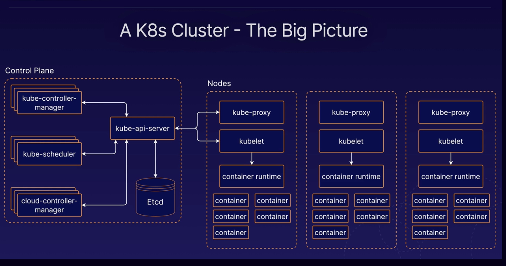

# K8s Control Plane and Components

The control plane is collection of multiple compnents resonsible for managing the cluster globally.

Individual control plane compnents can run on any machine in the cluster, but usually are run on dedicated *controller* machines.

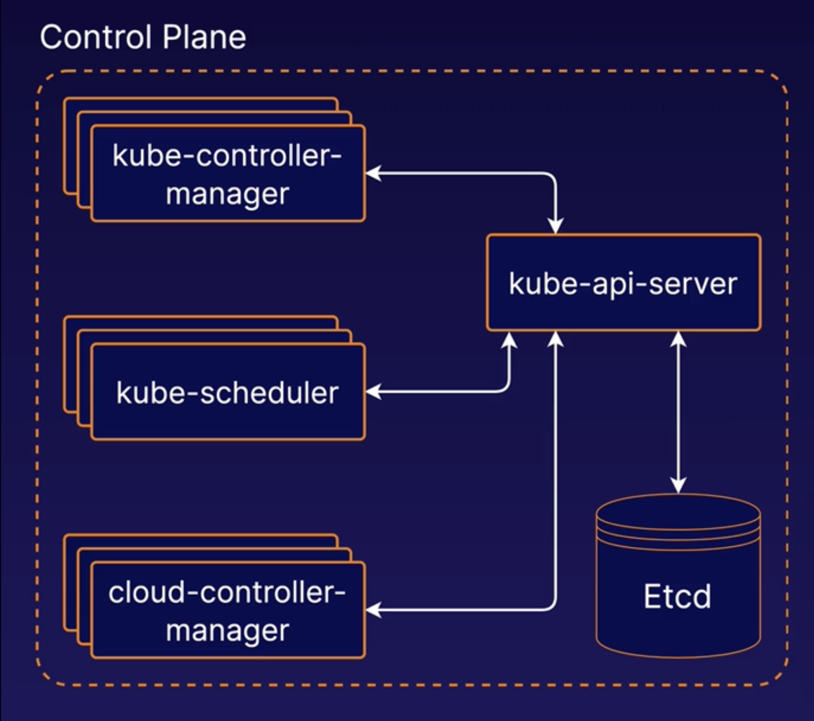

## kube-api-server

Frontend; serves the K8s API which is the primary interface to the control plane and cluster itself.

You will usually interact with your cluster with this API.

config lives at `/etc/kubernetes/manifests/kube-apiserver.yaml`

service config lives at `/etc/systemd/system/kube-apiserver.service`

## etcd

ETCD is a distributed reliable key-value store (unlike a traditional tabular/relational database with columns and rows.) that is simple, secure and fast.

Backend data store for the kubernetes cluster/API. Provides high-availability storage for all data relating to the state of the cluster.

Everytime you run `kubectl get ...` you are retrieving info from the etcd server.

Listens on port 2379 by default.

When performing operations against the API, data is being read from and written to etcd.

### etcd commands

Additional information about ETCDCTL Utility

ETCDCTL is the CLI tool used to interact with ETCD.

ETCDCTL can interact with ETCD Server using 2 API versions - Version 2 and Version 3.  By default its set to use Version 2. Each version has different sets of commands.

For example ETCDCTL version 2 supports the following commands:

```
etcdctl backup
etcdctl cluster-health
etcdctl mk
etcdctl mkdir
etcdctl set
```

Whereas the commands are different in version 3

```
etcdctl snapshot save 
etcdctl endpoint health
etcdctl get
etcdctl put
```

To set the right version of API set the environment variable ETCDCTL_API command

 `export ETCDCTL_API=3`

When API version is not set, it is assumed to be set to version 2. And version 3 commands listed above don't work. When API version is set to version 3, version 2 commands listed above don't work.

Apart from that, you must also specify path to certificate files so that ETCDCTL can authenticate to the ETCD API Server. The certificate files are available in the etcd-master at the following path. We discuss more about certificates in the security section of this course. So don't worry if this looks complex:

```
--cacert /etc/kubernetes/pki/etcd/ca.crt     
--cert /etc/kubernetes/pki/etcd/server.crt     
--key /etc/kubernetes/pki/etcd/server.key
```

So for the commands I showed in the previous video to work you must specify the ETCDCTL API version and path to certificate files. Below is the final form:

```bash
kubectl exec etcd-master -n kube-system -- sh -c "ETCDCTL_API=3 etcdctl get / --prefix --keys-only --limit=10 --cacert /etc/kubernetes/pki/etcd/ca.crt --cert /etc/kubernetes/pki/etcd/server.crt  --key /etc/kubernetes/pki/etcd/server.key" 
```

## kube-scheduler

Scheduling means selecting an available node in the cluster on which to run containers. **This does not place the pod on the node, kubelet does that**

When using the API, for example, to run a pod or container, kube-scheduler is the component responsbile for assigning that container to a worker node, and kubelete creates that pod.

View kube-scheduler options - kubeadm: `/etc/kubernetes/manifests/kube-scheduler.yaml`

## kube-controller-manager

Runs a collection of multiple controller utilities in a single process.

Manages utility processes related to automation within the cluster. Watch status, remediate situation.

Controller: a process that continuously monitors the state of the components within the system. 

When you install this, it also installs the various other [controllers](https://kubernetes.io/docs/concepts/architecture/controller/)

In case any controllers dont work or dont exist, this would be a good place to start. 

View kube-controller-manager options - kubeadm: `/etc/kubernetes/manifests/kube-controller-manager.yaml`

Options are at: `/etc/systemd/system/kube-controller-manager.service`

## cloud-controller-manager

Provides an interface between K8s and various cloud platforms. Only used when using cloud-based resources alongside K8s.

# K8s Nodes

Machines where containers are run in the cluster.

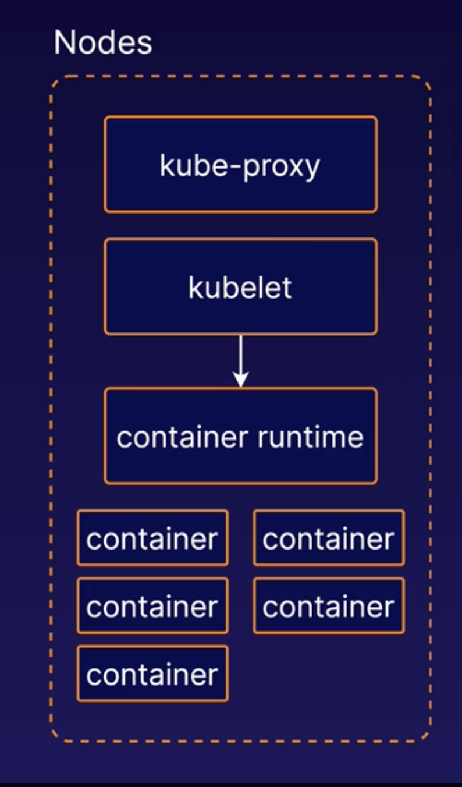

## kubelet

K8s agent that runs on each node. Communicates with the control plane. Basically manages containers on each node.

When it recieves instructions to load a pod or container, it pulls the image and runs it on the node. Then monitors.

Handles process of reporting container status and other data about containers back to the control plane. Status of the node, various information about each container running on that node, etc.

**Must always manually install kubelet on your wokrer nodes**

To check: `ps -aux | grep kubelet`

## container runtime

Separate from K8s, not built in. Separate piece of software for actually running the containers.

K8s supports multiple container runtime implementations including Docker and containerd.

## [kube-proxy](https://kubernetes.io/docs/reference/command-line-tools-reference/kube-proxy/)

Network proxy, runs on each node and handles some tasks relating ot networking between containers and services in the cluster.

Deployed as a daemonset so a pod is always deployed on each node in the cluster.

# Building a K8s cluster

## kubeadm

Tool that will simplify the process of setting up our kubernetes cluster.

[Building a Kubernetes Cluster](./assets/1623334133949-Building%20a%20Kubernetes%20Cluster.pdf)

# Using [Namespaces](https://kubernetes.io/docs/concepts/overview/working-with-objects/namespaces/) in K8s

Namespaces are essentially virtual clusters backed by the same physcial cluster. Kubernetes objects, such as pods and containers, live in namespaces. Namepsaces are a way to separate and organize objecs in your cluster.

In Kubernetes, namespace provides a mechanism for isolating groups of resources within a single cluster. Names of resources need to be unique within a namespace, but not across namespaces. Namespace-based scoping is applicable only for namespaced objects (e.g. Deployments, Services, etc) and not for cluster-wide objects (e.g. StorageClass, Nodes, PersistentVolumes, etc).

Kubernetes starts with four initial namespaces:

* `default` The default namespace for objects with no other namespace

* `kube-system` The namespace for objects created by the Kubernetes system

* `kube-public` This namespace is created automatically and is readable by all users (including those not authenticated). This namespace is mostly reserved for cluster usage, in case that some resources should be visible and readable publicly throughout the whole cluster. The public aspect of this namespace is only a convention, not a requirement.

* `kube-node-lease` This namespace holds Lease objects associated with each node. Node leases allow the kubelet to send heartbeats so that the control plane can detect node failure.

Useful for different apps in your cluster or for different teams in your cluster

List existing namespaces: `kubectl get namespaces`

All clusters have a default namespace. This is use when no other namespace is specified. **NOTE:** the default namespace is used when no other namespaces are specified. K8s is going to assume you want to use that default namespace.

create a pod in desired namespace: `kubectl create -f pod-definition.yml --namespace=dev`

Kubeadm clusters also have a namespace called `kube-system` , which contains system components, such as the components of the Kubernetes control plane itself.

When you're working with Kubernetes via kubectl, you may need to sometimes specify a namespace and you can do this with the
`--namespace` flag: `kubectl get pods --namespace my-namespace`

Create a namespace: `kubectl create namespace my-namespace` or:

```yaml
apiVersion: v1
kind: Namespace
metadata:
  name: dev
```

Switch namespace (important for exam to be in the right NS): `kubectl config set-context $(kubectl config current-context) --namespace=dev` or `kubectl config set-context --current --namespace=dev`

# K8s Management

## Intro to K8s High-Availability (HA)

K8s facilitates HA applications, but you can also design the cluster itself to be HA. Need *multiple control plane nodes* to do this.

When using multiple control planes for HA, you will likely need to communicate with the K8s API via a Load Balancer. This iobncludes clients such as kubelet instances running on worker nodes. 

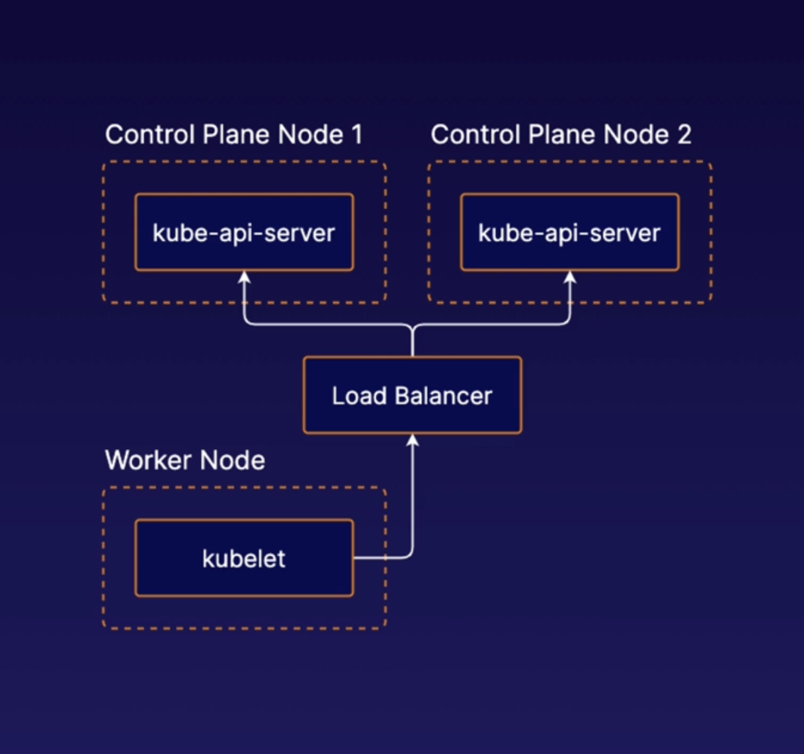

### Stacked etcd


Runs on the same nodes as the rest of the control plane components. Design pattern used by clusters that are setup by `kubeadm` .

Each individual control plane nodes would have it's own etcd instance.

### External etcd

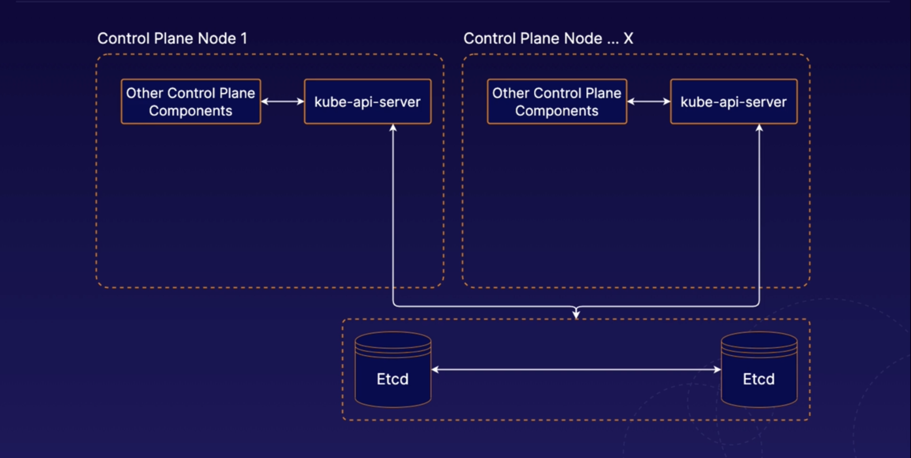

Etcd lives on completely different servers than where we are running our normal K8s control plane components. 

You can have any numver of K8s control plane instances and any number of etcd nodes. 

## Intro K8s Management [Tools](https://kubernetes.io/docs/reference/tools/)

There is a variety of management tools available for K8s. These tools interface with K8s to provide additional functionality. When using K8s, it is a good idea to be aware of some of these tools.

### `kubectl`

The official command line interface for K8s. It is the main method of interacting with K8s in the CKA.

### `kubeadm`

Tool that allows you to quickly and easily create K8s clusters. Like setting up the control plane and worker nodes.

### minikube

Allows for easy setup of a cluster with a single machine. Supports multi-nodes on local device.

### [Helm](https://medium.com/prodopsio/a-6-minute-introduction-to-helm-ab5949bf425)

Provides templating and package management system for K8s objects. You can use it to manage your own templates (known as charts). You can also download and use shared templates. 

### Kompose

Helps you translate Docker compase files into K8s objects.

### Kustomize

A config mananagement tool for managing K8s object configs. 

## Safely Draining a K8s Node

### What is draining?

When performing maintenance, you may sometimes need to remove a K8s node from service.

To do this, you can drain the node. Containers running on the node will be gracefully terminated (and potentially rescheduled to another node)

Diagram of drain process:

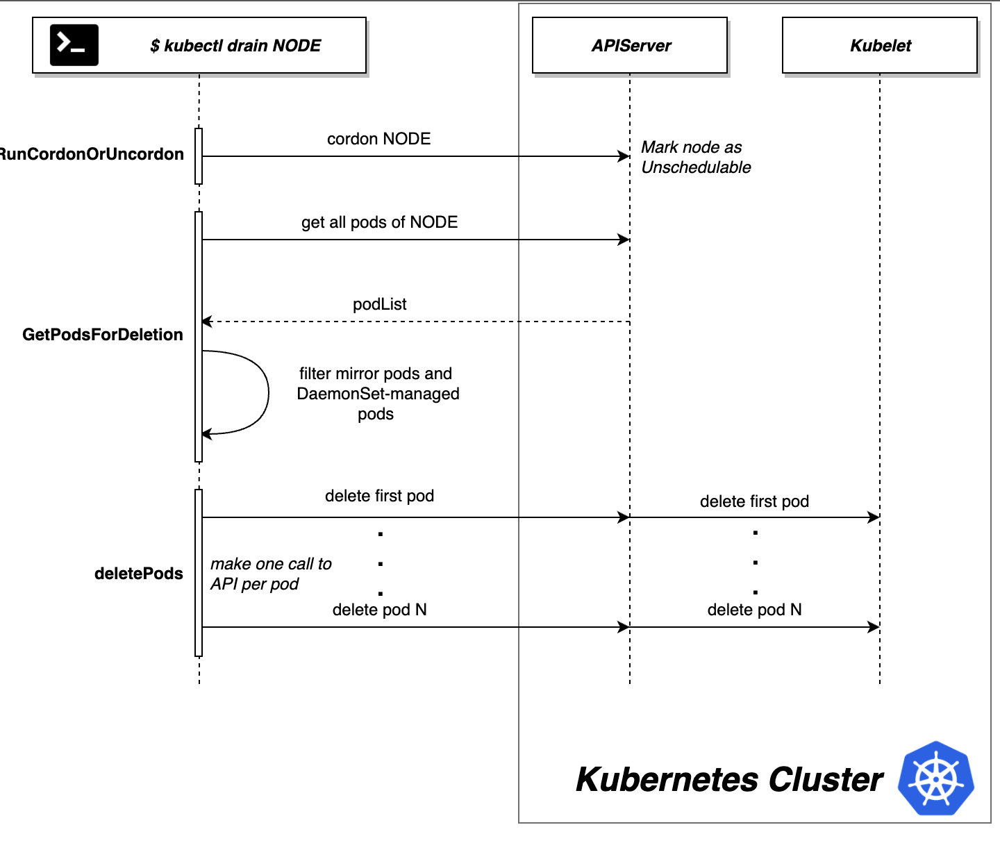

### How to drain

To drain a node, use the `kubectl drain` command, e.g. `kubectl drain <node name> --ignore-daemonsets`

When draining a node, you may need to ignore [DaemonSets](https://kubernetes.io/docs/concepts/workloads/controllers/daemonset/) (like the command above). DaemonSets are pods that are tied to each node. If you have any DaemonSet pods running on the node, you will likely need to use the `--ignore-daemonsets` flag.

Uncordoning a Node - If the node remains part of the lcuster, you can allow pods to run on the node again when maintenance is complete using `kubectl uncordon <node name>` .

Cordoning the node means no pods should run on that node. 

In our lab, we got this error:

```
cloud_user@k8s-control:~$ kubectl drain k8s-worker1
node/k8s-worker1 cordoned
error: unable to drain node "k8s-worker1", aborting command...

There are pending nodes to be drained:
 k8s-worker1
cannot delete Pods not managed by ReplicationController, ReplicaSet, Job, DaemonSet or StatefulSet (use --force to override): default/my-pod
cannot delete DaemonSet-managed Pods (use --ignore-daemonsets to ignore): kube-system/calico-node-28p6s, kube-system/kube-proxy-bfpmh
```

Two things happening here, let's take a closer look at these errors:

1. `cannot delete Pods not managed by ReplicationController, ReplicaSet, Job, DaemonSet or StatefulSet (use --force to override): default/my-pod`
   
   This is referring to our individual pod we created: `default/my-pod` . It is not able to reschedule that pod to another worker node. It's going to abort the drain process because it doesn't want to just delete that pod

2. `cannot delete DaemonSet-managed Pods (use --ignore-daemonsets to ignore): kube-system/calico-node-28p6s, kube-system/kube-proxy-bfpmh`
    This is saying that it's not able to delete those DaemonSet managed pods. If we look closer, `kube-system/calico-node-28p6s, kube-system/kube-proxy-bfpmh` are K8s system pods that were created when we installed the calico networking plguin and also the kubeadm process.

To solve the first error, we want to use `--force` , which will actually delete that first pod. If you're in a situation where you can't lose that pod, don't use `--force`

After running `kubectl drain k8s-worker1 --ignore-daemonsets --force` , we see that the pods are evicted:

```
cloud_user@k8s-control:~$ kubectl drain k8s-worker1 --ignore-daemonsets --force
node/k8s-worker1 already cordoned
WARNING: ignoring DaemonSet-managed Pods: kube-system/calico-node-28p6s, kube-system/kube-proxy-bfpmh; deleting Pods not managed by ReplicationController, ReplicaSet, Job, DaemonSet or StatefulSet: default/my-pod
evicting pod default/my-pod
pod/my-pod evicted
node/k8s-worker1 evicted
```

`my-pod` is essentially deleted. But pods part of the deployment (not `my-pod` ), we will see that another replica was scheduled to run just to keep that number of deployment replicas at 2:

```
cloud_user@k8s-control:~$ kubectl get pods -o wide
NAME                             READY   STATUS    RESTARTS   AGE   IP              NODE          NOMINATED NODE   READINESS GATES
my-deployment-5f85c44867-q7ds5   1/1     Running   0          20m   192.168.126.2   k8s-worker2   <none>           <none>
my-deployment-5f85c44867-v4s97   1/1     Running   0          20m   192.168.126.1   k8s-worker2   <none>           <none>
```

We see that both replicas are now running on the second worker node.

Last thing is uncordon and clean up (notice the `Ready,SchedulingDisabled` ) on the first worker node after draining:

```
cloud_user@k8s-control:~$ kubectl get nodes
NAME          STATUS                     ROLES                  AGE   VERSION
k8s-control   Ready                      control-plane,master   44h   v1.21.0
k8s-worker1   Ready,SchedulingDisabled   <none>                 44h   v1.21.0
k8s-worker2   Ready                      <none>                 44h   v1.21.0
```

Uncordon the node:

```
cloud_user@k8s-control:~$ kubectl uncordon k8s-worker1
node/k8s-worker1 uncordoned
```

Uncordoning the node did not rebalance the pods. If you schedule any new pods or deployments, they will run on that node. 

Clean up:

```
cloud_user@k8s-control:~$ kubectl delete deployment my-deployment
deployment.apps "my-deployment" deleted
```

Walkthrough: [Safely Draining a Node](./assets/safe_draining.pdf)

#### Notes on Deployments

`kubectl get pods -o wide` - the `-o wide` gives node information as well.

In our deployments, when we specify replicas, each replica should run on a different node ( # TODO: fact-check this). If you find that both replicas are running on the same node, increase the replicas until they are runnign on different nodes.

[Pods vs. Deployments](https://stackoverflow.com/questions/41325087/what-is-the-difference-between-a-pod-and-a-deployment)

## Upgrading K8s with `kubeadm`

Important to note: no component version should be higher than the kube api server.

See [supported version skew](https://kubernetes.io/releases/version-skew-policy/#supported-version-skew) for more info.

Only last three minor versions supported. If you are on 1.19 and 1.20 comes out, you should upgrade because when 1.22 is released, your current 1.19 version won't be supported anymore. **Upgrade one minor version at a time, do not jump from say 1.19 to 1.22**

[Reference materials](https://kubernetes.io/docs/tasks/administer-cluster/kubeadm/kubeadm-upgrade/) from official documentation.

### Control plane upgrade steps

1. Drain the node
 `kubectl drain k8s-control --ignore-daemonsets`

2. Upgrade kubeadm on the control plane node

```
sudo apt-get update && \

# override that kubeadm is in in the hold status which prevents upgrades
sudo apt-get install -y --allow-change-held-packages kubeadm=1.22.2-00
```

3. Plan the upgrade (`sudo kubeadm upgrade plan v1.22.2`)
* This command will give information about what will need to be changed in order to perform this upgrade 
4. Apply the upgrade (`sudo kubeadm upgrade apply v1.22.2`)
5. Upgrade kubelet and kubectl on the control plane node

```
sudo apt-get update && \
sudo apt-get install -y --allow-change-held-packages kubelet=1.22.2-00 kubectl=1.22.2-00
```

6. In case kubelete service had any changes, run `sudo systemctl daemon-reload` and `sudo systemctl restart kubelet`
7. Uncordon the control plane node with `kubectl uncordon k8s-control`

### Worker node upgrade steps

1. Drain the node
2. Upgrade kubeadm
3. Upgrade the kubelet configuration ( `kubeadm upgrade node` )
4. Upgrade kubelet and kubectl
5. Uncordon the node

Steps found [here](./assets/upgrade_kubeadm.pdf)

## Backup and restore etcd cluster data

[Reference docs](https://kubernetes.io/docs/tasks/administer-cluster/configure-upgrade-etcd/#backing-up-an-etcd-cluster)

### Why back up etcd?

`etcd` is the backend data storage solution for your kubernetes cluster. As such, all your Kubernetes objects, applications, and configurations are stored in etcd. 

Therefore, you will likely want to be able to back up your cluster's data by backing up etcd. If your etcd data is lost, you'll have to rebuild all your k8s applications by hand.

### Backing it up

We will back up data by using the `etcdctl` command line tool.

Using `etcdctl snapshot save` command to back up the data. `ETCDCTL_API=3 etcdctl --endpoints $ENDPOINT snapshot save <filename>`

### Restoring etcd

You can [restore](https://kubernetes.io/docs/tasks/administer-cluster/configure-upgrade-etcd/#restoring-an-etcd-cluster) etcd data from a backup using the `etcdctl snapshot restore` command. You will need to supply some additional parameters, as the restore operation creates a new logical cluster.

Lab Guide:

```
Introduction
Backups are an important part of any resilient system. Kubernetes is no exception. In this lab, you will have the opportunity to practice your skills by backing up and restoring a Kubernetes cluster state stored in etcd. This will help you get comfortable with the steps involved in backing up Kubernetes data.

Solution
Log in to the provided lab server using the credentials provided:

ssh cloud_user@<PUBLIC_IP_ADDRESS>
Back Up the etcd Data
Look up the value for the key cluster.name in the etcd cluster:

ETCDCTL_API=3 etcdctl get cluster.name \
  --endpoints=https://10.0.1.101:2379 \
  --cacert=/home/cloud_user/etcd-certs/etcd-ca.pem \
  --cert=/home/cloud_user/etcd-certs/etcd-server.crt \
  --key=/home/cloud_user/etcd-certs/etcd-server.key
The returned value should be beebox.

Back up etcd using etcdctl and the provided etcd certificates:

ETCDCTL_API=3 etcdctl snapshot save /home/cloud_user/etcd_backup.db \
  --endpoints=https://10.0.1.101:2379 \
  --cacert=/home/cloud_user/etcd-certs/etcd-ca.pem \
  --cert=/home/cloud_user/etcd-certs/etcd-server.crt \
  --key=/home/cloud_user/etcd-certs/etcd-server.key
Reset etcd by removing all existing etcd data:

sudo systemctl stop etcd
sudo rm -rf /var/lib/etcd
Restore the etcd Data from the Backup
Restore the etcd data from the backup (this command spins up a temporary etcd cluster, saving the data from the backup file to a new data directory in the same location where the previous data directory was):

sudo ETCDCTL_API=3 etcdctl snapshot restore /home/cloud_user/etcd_backup.db \
  --initial-cluster etcd-restore=https://10.0.1.101:2380 \
  --initial-advertise-peer-urls https://10.0.1.101:2380 \
  --name etcd-restore \
  --data-dir /var/lib/etcd
Set ownership on the new data directory:

sudo chown -R etcd:etcd /var/lib/etcd
Start etcd:

sudo systemctl start etcd
Verify the restored data is present by looking up the value for the key cluster.name again:

ETCDCTL_API=3 etcdctl get cluster.name \
  --endpoints=https://10.0.1.101:2379 \
  --cacert=/home/cloud_user/etcd-certs/etcd-ca.pem \
  --cert=/home/cloud_user/etcd-certs/etcd-server.crt \
  --key=/home/cloud_user/etcd-certs/etcd-server.key
The returned value should be beebox.
```

# K8s Object Management

References for objects:

[Kubeneretes.io documentation on objects](https://kubernetes.io/docs/concepts/overview/working-with-objects/kubernetes-objects/)
[Understanding kubernetes objects](https://www.magalix.com/blog/understanding-kubernetes-objects)

You can also run `kubectl api-resources` to get all k8s objects.

## Labels and Selectors

[Labels](https://kubernetes.io/docs/concepts/overview/working-with-objects/labels/) are key value pairs to organize objects.

Sample ReplicaSet with three different pods:

```yaml
apiVersion: apps/v1
kind: ReplicaSet
metadata:
  name: frontend
  # these labels are for the replicaset itself, used for other objects to discover this replicaset
  labels:
    app: guestbook
    tier: frontend
spec:
  replicas: 3
  selector:
    # this connects teh replicaset to the pods
    matchLabels:
      tier: frontend
  template:
    metadata:
      # these are the labels configured on the PODS themselves
      labels:
        tier: frontend
    spec:
      containers:
      - name: php-redis
        image: gcr.io/google_samples/gb-frontend:v3
```

[Annotations](https://kubernetes.io/docs/concepts/overview/working-with-objects/annotations/) allow you to attach non-identifying metadata to objects.

Clients such as tools and libraries can retireve this metadata. 

To label a node: `kubectl label nodes <node-name> <label-key>=<label-value>` e.g. `kubectl label nodes node1 size=Large`

## Basic commands - working with `kubectl`

### `kubectl get`

Use kubectl get to list objects in the K8s cluster:
 `kubectl get <object type> <object name> -o <output> --sort-by <JSONPath> --selector <selector>`

* `-o`: set output format like yaml or json
* `--sort-by`: sort output using a JSONPath expression
* `--selector`: filter results by [label](https://kubernetes.io/docs/concepts/overview/working-with-objects/labels/)

### `kubectl create`

Used to create objects. Supply a YAML file with `-f` to create an object from a YAML descripto stored in a file. 

 `kubectl create -f <file name>`

If you attempt to create an object that already exists, an error will occur.

### `kubectl apply`

Similar to to `kubectl create` . However, if you use `kubectl apply` on and object that already exists, it will modify the existing object, if possible.

 `kubectl apply -f <file name>`

### `kubectl delete`

Deletes objects from the cluster.

 `kubectl delete <object type> <object name>`

### `kubectl exec`

Run commands inside containers. KLeep in mind that, in order for a command to succeed, the necessary software must exist within the container to run it. For toubleshooting and seeing what is going on inside your containers. use `-c` if your pod has multiple containers.

 `kubectl exec <pod name> -c <container name> -- <command>`

### More on `kubectl`

More info on [ `kubectl` operations](https://kubernetes.io/docs/reference/kubectl/overview/)

And even more in depth [here](https://kubernetes.io/docs/reference/generated/kubectl/kubectl-commands#-strong-getting-started-strong-).

## Imperative commands

So far, we've been using [*declarative*](https://kubernetes.io/docs/tasks/manage-kubernetes-objects/declarative-config/) commands which define objects using data structures such as YAML or JSON and using `kubectl create|apply` to instantiate those objects.

Imperative commands define objects using kubectl commands and flags instead of yaml files, e.g. `kubectl create deployment my-deployment --image=nginx`

## Quick sample YAML

Use the `--dry-run` flag to run an imperative command without creating an object. Combine it with `-o yaml` to quickly obtain a sample yaml file you can manipulate.

You can record a command with the `--record` flag. E.g. `kubectl scale deployment my-deployment --replicas=5 --record` .

Then, within the object after `kubectl describe <object>` you can see the command in the annotations. 

## Use the docs

You can often find YAML examples in the K8s documentation. You are allowed to use this documentation during the exam. Feel free to copy and paste example YAML and/or coammdns from the docs.

## RBAC

[RBAC](https://kubernetes.io/docs/reference/access-authn-authz/rbac/) allows you to control what users are allowed to do and access in your cluster. E.g. allow devs to read metadat and logs from K8s pods but not make changes to them.

### Roles and Cluster Roles

K8s objects that define a set of perms. These perms determine what users can do in the cluster. 

A *Role* defines perms within a particular ns, and a *ClusterRole* defines cluster-wide perms not specific to a single namespace. *RoleBindings* are objects that link users to *Roles* and *ClusterRoleBindings* link users to *ClusterRoles*. 

*RoleBinding* and *ClusterRoleBinding* are objects that connect Roles and ClusterRoles to users. These determine which users are allowed to use the permissions that are defined in the role and cluster. 


[Sample RBAC Config](./assets/rbac_sample.pdf)

For roles, need both a `role` and `roleBinding` definition (in two separate files? # TODO fact-check this). same with cluster stuff. 

In our role file, `rules:` define what permissions are associated with a partocular role. Define a set of `resources:` , `verbs:` state what action can be done with the resource

In our rolebinding file, `subjects:` defines what users this role binding applies to. `roleRef:` is what connects our role binding to the actual role. 

### For hands-on lab:

"Create a role called pod-reader. Provide it with read access to pods and container logs in the beebox-mobile namespace."

Solution:

* generate yaml file for role using imperative command: `kubectl create role pod-reader --resource=pods,pods/log --namespace=beebox-mobile --verb=get,list,watch --dry-run=client -o yaml > pod-reader-role.yml`
* generate roleBinding yml: `kc create rolebinding pod-reader --role=pod-reader --user=dev --namespace=beebox-mobile --dry-run=client -o yaml > pod-reader-rolebinding.yml`

`kubectl apply -f` both, profit. 

## Service accounts

In K8s a [service account](https://kubernetes.io/docs/tasks/configure-pod-container/configure-service-account/) is an account used by container processes within pods to authenticate with the K8s API.

If your pods need to communicate with the k8s API, you can use service accounts to control their access.

### Creating service accounts

A service account object can be created with some YAML just like any other k8s object:

```yaml
apiVersion: v1
kind: ServiceAccount
metadata:
  name: my-serviceaccount
```

You can manage access control for service accounts, just like anyother use, using RBAC objects.

Bind service accounts with ClusterRoles or ClusterRoleBindings to provide access to K8s API functionality.

What it looks like to bind a role to a service account usign a RoleBinding:

```yaml
apiVersion: rbac.authorization.k8s.io/v1
kind: RoleBinding
metadata:
  name: sa-pod-reader
subjects:
- kind: Service Account
  name: my-serviceaccount
  namespace: default
roleRef:
  kind: Role
  name: pod-reader
  apiGroup: rbac.authorization.k8s.io
```

`kubectl get sa` will list service accounts.

`kubectl describe sa my-serviceaccount` will describe the service account.

## Inspecting Pod Resource Usage

[Tools for monitoring resources](https://kubernetes.io/docs/tasks/debug-application-cluster/resource-usage-monitoring/)

[ `kubectl` cheat sheet](https://kubernetes.io/docs/reference/kubectl/cheatsheet/#interacting-with-running-pods)

[Resource metrics pipeline](https://kubernetes.io/docs/tasks/debug-application-cluster/resource-metrics-pipeline/)

## Logging and Monitoring

 `kubectl logs <object-name>`

### K8s Metrics Server

In order to view metrics about the resources pods and containers are using, we need an add-on to collect and provide that data. One such add-on is the Kubernetes Metrics Server.

Once we've installed the add-on we can use `kubectl top` command.
* Can view data abour reource usage in your pods and nodes
* Also supports flags like `--sort-by` and `--selector`
* `kubectl top pod --sort-by <JSONPATH> --selector <selector>`

How to install and use (basic): [Hands-on demo](./assets/inspecting_resources.pdf)

Querying the metrics server API: `kubectl get --raw /apis/metrics.k8s.io`

Can also check node CPU usage: `kubectl top node`

## Services

Enable communications between various components between internal resources and external services. 

Helps us connect applications together with other applications or users. E.g. connectivity between groups of pods. 

Enable loose coupling between microservices in our application.

### [Service Types](https://kubernetes.io/docs/concepts/services-networking/service/#publishing-services-service-types)

#### NodePort

Three ports involved: TargetPort (on the pod), Port (in the service), and NodePort (on the node)

Port range is 30000-30767.

Allow you to expose ports from the node to the pods. Creates service across nodes. 

```yaml
apiVersion: v1
kind: Service
metadata:
  name: myapp-service
spec:
  type: NodePort
  ports: #array/list, can have multiple port mappings
  - targetPort: 80
    port: 80
    nodePort: 30008
  selector: # match labels below to pods or deployments you want this attached to
    app: my-app
    type: front-end
```

#### ClusterIP

Exposes the service on a cluster-internal IP. Makes this only reachable from within the cluster. This is the default `ServiceType` .

```yaml
apiVersion: v1
kind: Service
metadata:
  name: back-end
spec:
  type: ClusterIP
  ports: #array/list, can have multiple port mappings
  - targetPort: 80 # port where the back end is exposed
    port: 80 # port where the service is exposed
  selector: # match labels below to pods or deployments you want this attached to
    app: my-app
    type: back-end
```

#### LoadBalancer

Exposes the Service externally using a cloud provider's load balancer. `NodePort` and `ClusterIP` Services, to which the LB routes, are automatically created.

```yaml
apiVersion: v1
kind: Service
metadata:
  name: my-service
spec:
  type: LoadBalancer
  selector:
    app: MyApp
  ports:
    - protocol: TCP
      port: 80
      targetPort: 9376
  clusterIP: 10.0.171.239
status:
  loadBalancer:
    ingress:
    - ip: 192.0.2.127
```

Sample imperative command for creating a service to expose `simple-webapp-deployment` on port 8080 (will need to configure `nodePort` in the yaml definition):

 `kubectl expose deployment simple-webapp-deployment --name=webapp-service --target-port=8080 --type=NodePort --port=8080 --dry-run=client -o yaml`

Create a Service named redis-service of type ClusterIP to expose pod redis on port 6379

 `kubectl expose pod redis --port=6379 --name redis-service --dry-run=client -o yaml`

(This will automatically use the pod's labels as selectors)

Or

`kubectl create service clusterip redis --tcp=6379:6379 --dry-run=client -o yaml` (This will not use the pods labels as selectors, instead it will assume selectors as app=redis. You cannot pass in selectors as an option. So it does not work very well if your pod has a different label set. So generate the file and modify the selectors before creating the service)

Create a Service named nginx of type NodePort to expose pod nginx's port 80 on port 30080 on the nodes:

 `kubectl expose pod nginx --type=NodePort --port=80 --name=nginx-service --dry-run=client -o yaml`

(This will automatically use the pod's labels as selectors, but you cannot specify the node port. You have to generate a definition file and then add the node port in manually before creating the service with the pod.)

Or

 `kubectl create service nodeport nginx --tcp=80:80 --node-port=30080 --dry-run=client -o yaml`

(This will not use the pods labels as selectors)

Both the above commands have their own challenges. While one of it cannot accept a selector the other cannot accept a node port. I would recommend going with the kubectl expose command. If you need to specify a node port, generate a definition file using the same command and manually input the nodeport before creating the service.

Can use `--expose` within pod create command to automatically create a service:

 `kubectl run <pod-name> --image=httpd:alpine --port=80 --expose --dry-run=client -o yaml`

# Pods and Containers

Usually have a 1:1 pod:container relationship within your cluster.

Top level fields, [must have them](https://kubernetes.io/docs/concepts/overview/working-with-objects/kubernetes-objects/#required-fields):

```yaml
apiVersion:
kind:
metadata:

spec:

```

`apiVersion` :
| Kind | Version |
| ---- | ------- |
| POD | v1 |
| Service | v1 |
| ReplicaSet | apps/v1 |
| Deployment | apps/v1 |

`metadata` is in the form of a dictionary. Information about the object (name, labels, etc.)

Can have as many labels as your want in any key-value format.

`containers` under `spec` is an list/array because you can have as many contianers as you want.

Example:

```yaml
apiVersion: v1
kind: Pod
metadata: 
  name: myapp-pod
  labels:
    app: myapp
    type: front-end
spec:
  containers:
  - name: nginx-container # "-" means first item in list.
    image: nginx
```

## Managing application configuration

When you are running apps in K8s, you may want to pass dynamic values to your applications at runtime to control how they behave. This is known as application configuration.

Bascially passing data to containers that conrols how they run. 

You can store configuration data in [ConfigMaps](https://kubernetes.io/docs/concepts/configuration/configmap/). These are key-value maps and they can be passed to your container applications.

Can also store config data in [Secrets](https://kubernetes.io/docs/concepts/configuration/secret/), which is for more sensitive data. These need to be b64 encoded within a yaml file.
One way to pass the configmap and secrets to your containers is through [environment variables](https://kubernetes.io/docs/tasks/inject-data-application/define-environment-variable-container/).
These variables will be visible to your container process at runtime:

```yaml
spec:
  containers:
  - ...
    env:
    - name: ENVVAR
      valueFrom:
        configMapRef:
          name: my-configmap
          key: mykey
```

`$ENVVAR` will then be passed to our container process.

Configuration data from ConfigMaps and Secrets can also be passed to containers in the form of mounted volumes. This will cause the configuration data to appear in files available to the container file system.

Each top-level key in the configuration data will appear as a file containing all keys below that top-level key.

[Hands-on demo](./assets/config_maps_and_secrets.pdf)

## Managing container resources

Memory notes, pay attention to, say, G vs. Gi:

1 G (Gigabyte) = 1, 000, 000, 000 bytes
1 M (Megabyte) = 1, 000, 000 bytes
1 K (Kilobyte) = 1, 000

1 Gi (Gibibyte) = 1, 073, 741, 824 bytes
1 Mi (Mebibyte) = 1, 048, 576 bytes
1 Ki (Kibibyte) = 1, 024 bytes

Default resource requirements and limits for [memory](https://kubernetes.io/docs/tasks/administer-cluster/manage-resources/memory-default-namespace/) and [cpu](https://kubernetes.io/docs/tasks/administer-cluster/manage-resources/cpu-default-namespace/) attached. And here is [assigning memory resource](https://kubernetes.io/docs/tasks/configure-pod-container/assign-memory-resource).

### Resource requests

[Resource requests](https://kubernetes.io/docs/concepts/configuration/manage-resources-containers/#requests-and-limits) allow you to define an amount of resources (like CPU and mem) that a container can use or you expect it to use. The scheduler will then avoid scheduling pods on nodes that do not have the available resources. 

Example: if your resource request is asking for 5 gb of mem, and there isn't 5 gb available on a node, the scheduler will look for a different node with that mem available.

**NOTE:** containers are allowed to use more (or less) than the requested resources. *Resource requests only affect scheduling, not what happens after the pod is scheduled for a node*. Moreover, the resource request does not force the container to stay within that limit. 

Example resource request, more on units [here](https://kubernetes.io/docs/concepts/configuration/manage-resources-containers/#resource-units-in-kubernetes):

```yaml
apiVersion: v1
kind: Pod
metadata:
  name: my-pod
spec:
  containers:
  - name: busybox
    image: busybox
    ports:
    - containerPort: 8080
    resources:
      requests:
        # CPU is measured in CPU units, which are 1/1000 of one CPU or 1/4 of a cpu
        cpu: "250m" # this is 250 milli-CPUs
        # Memory is measured in bytes
        memory: "128Mi"
```

### Resource limits

The container runtime is responsible for enforcing the [resource limit](https://kubernetes.io/docs/concepts/configuration/manage-resources-containers/#requests-and-limits) after scheduling, and different CRs do this differently.

Some runtimes will enforce these limits by terminating container processes that attempt to use more than the allowed amount of resources.

Example resource limit:

```yaml
apiVersion: v1
kind: Pod
metadata:
  name: my-pod
spec:
  containers:
  - name: busybox
    image: busybox
    resources:
      limits:
        cpu: "250m"
        memory: "128Mi" 
```

[Hands-on demo](./assets/resources_hands_on.pdf)

## Monitor container health with [probes](https://kubernetes.io/docs/concepts/workloads/pods/pod-lifecycle/#types-of-probe)

### Container health

K8s provides a number of features that allow you to build robust apps, such as the ability to to automatically restart unhealthy containers. To make the most of those features, K8s needs to be able to accurately determine the status of your apps. This means actively monitoring container health. More in this in [pod lifecycle](https://kubernetes.io/docs/concepts/workloads/pods/pod-lifecycle/)

### Liveness Probes

Allows you to automatically determine whether or not a container application is in a healthy state and/or running. If the liveness probe fails, the kubelet kills the container, and the container is subjected to its [restart policy](https://kubernetes.io/docs/concepts/workloads/pods/pod-lifecycle/#restart-policy). If a container does not provide a liveness probe, the default state is `Success`

By default, *K8s will only consider a container to be "down" if the container process stops*. 

Liveness probes allow us to customize this detection mechanism and make it more sophisticated. Sometimes your containers might still be running. The process might not have stopped, but things are still broken. With liveness probes, we can detect those more sophisticated, more subtle situations where things aren't working, but the container is still running.

Can turn the threshold down on delay and period so that it recovers quicker. 

### Startup probes

Similar to liveness probes, but the difference is these run on startup and stop running once they succeed. Whereas liveness probes are constantly running and checking container status.

These check whether the application within the container has started. *All other probes are disabled if a startup probe is provided, until it succeeds*. 

If the startup probe fails, the kubelet kills the container and the container is subjected to its restart policy. If a container does not provide a startup probe, the default state is `Success`

### Readiness probes

Used to determine when a container is ready to accept requests. If the readiness probe fails, the endpoints controller removes the Pod's IP addess from the endpoints of all Services that match the Pod. 

When you have a service backed by multiple container endpoints, use traffic will not be sent to a particular pod until its containers have all passed the readiness checks defined by their readiness probes.

The default state of readiness before the initial delay is `Failure` . If a container does not provide a readiness probe, the default state is Success.

### [Check mechanisms](https://kubernetes.io/docs/concepts/workloads/pods/pod-lifecycle/#probe-check-methods)

These are ways to check containers using probes via different methods.

### Demo 

[Hands on demo for pod lifecycle and container Probes](./assets/probes_hands_on.pdf)

## Building Self-Healing Pods with [Restart Policies](https://kubernetes.io/docs/concepts/workloads/pods/pod-lifecycle/#restart-policy)

[Hands on demo](./assets/restart-policies.pdf)

Restart policies allow you to automatically restart containers when they fail. These policies allow you to customize this behavior by defining when you want a pods containers to be automatically restarted.

Able to define *when* or even *if* your containers should be auto-restarted. 

### "Always" restart policy

Always is the default policy in K8s. Containers will always be restarted if they stop, even if they completed successfully. 

_Use this policy for apps that should always be running._

Basically if the container stop or becomes unhelthy, it will be restarted.

### "OnFailure" restart policy

Will restart containers only if the container process exists with an error code or the container is determined to be unhealthy by a liveness probe. 

_Use this policy for applications that need to run successfully and then stop._

Example:

```yaml
apiVersion: v1
kind: Pod
metadata:
  name: onfailure-pod
spec:
  restartPolicy: OnFailure
  containers:
  - name: busybox
    image: busybox
    command: ['sh', '-c', 'sleep 10']
```

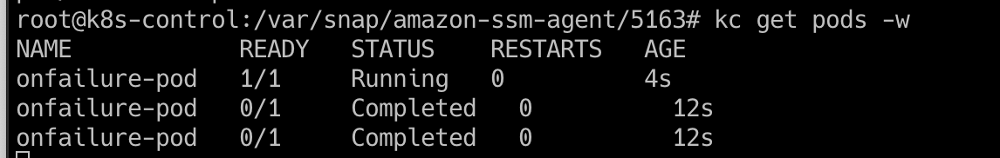

Because this pod completed successfully with no errors after it slept for 10 seconds, it was not restarted.

However with this code:

```yaml
apiVersion: v1
kind: Pod
metadata:
  name: onfailure-pod
spec:
  restartPolicy: OnFailure
  containers:
  - name: busybox
    image: busybox
    command: ['sh', '-c', 'sleep 10; this is a bad command that will fail']
```

We see it does restart on failure:

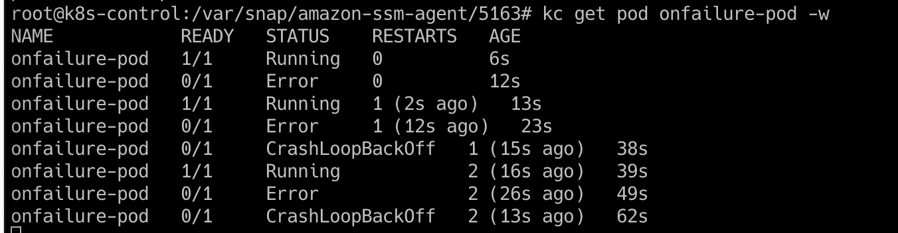

### "Never" restart policy

Essentially the opposite of the Always policy. Will never auto-restart pods. 

```yaml
apiVersion: v1
kind: Pod
metadata:
  name: never-pod
spec:
  restartPolicy: Never
  containers:
  - name: busybox
    image: busybox
    command: ['sh', '-c', 'sleep 10; this is a bad command that will fail']
```

The pod does not restart:

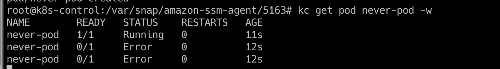

## Creating Multi-Container Pods

Resources:
* [Using Pods](https://kubernetes.io/docs/concepts/workloads/pods/#using-pods)
* [Shared Volumes](https://kubernetes.io/docs/tasks/access-application-cluster/communicate-containers-same-pod-shared-volume/)
* [Patterns for Composite Containers](https://kubernetes.io/blog/2015/06/the-distributed-system-toolkit-patterns/)
* [Creating Multi-Container Pods (PDF)](assets/creating_multi_container_pods.pdf)

### What is a multi-container pod?

A K8s pod can have one or more containers. A Pod with more than one container is a multi-container pod.

In a multi-container pod, the containers share resources such as storage and networking and will work together to provide functionality.

**It is best practice to keep containers in separate pods unless they need to share resources**

Cross-container interaction is when containers sharing the same pod can interact with one another using shared resources:

* Network: containers share the same networking namespace and can communicate with one another on any port, even if that port is not exposed to the cluster.
* Storage: containers can use shared volumes to share data in a pod

### Why use a multi-container pod?

[More info](https://www.mirantis.com/blog/multi-container-pods-and-container-communication-in-kubernetes/)

* **Sidecar containers:** “help” the main container. Some examples include log or data change watchers, monitoring adapters, and so on. A log watcher, for example, can be built once by a different team and reused across different applications. Another example of a sidecar container is a file or data loader that generates data for the main container.

* **Proxies, bridges, and adapters** connect the main container with the external world. For example, Apache HTTP server or nginx can serve static files. It can also act as a reverse proxy to a web application in the main container to log and limit HTTP requests. Another example is a helper container that re-routes requests from the main container to the external world. This makes it possible for the main container to connect to localhost to access, for example, an external database, but without any service discovery.

Sidecar example:

You have an app that is hard-coded to write log output to a file on disk. These logs will be harder to reach than normal because they are written to a file on the container filesystem rather than the console.  

You can add a sidecar container to the pod that reads the log file from a shared volume and prints it to the console so the log output will appear in the container log. 

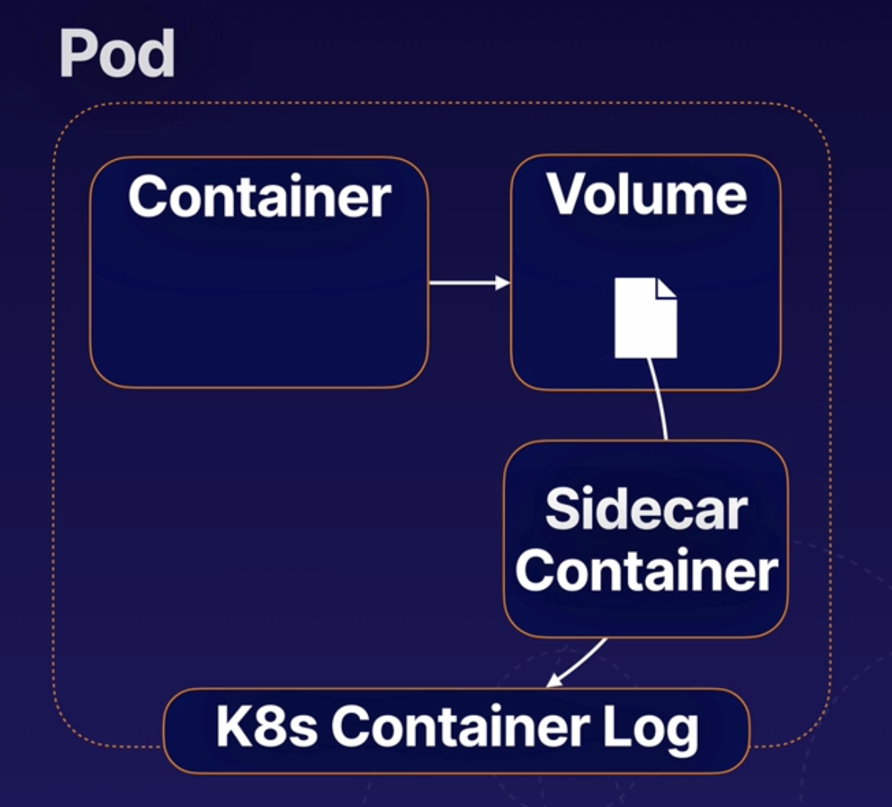

## [Init Containers](https://kubernetes.io/docs/concepts/workloads/pods/init-containers/)

[Reference material](assets/init_containers.pdf)

Containers that once during the startup process of a pod. A Pod can have any number of init containers, and they will each run once (in order) to completion.

Can perform a number of startup tasks. Offload startup tasks to init containers to keep things light and secure.

Use cases:
* Cause a pod to wait for another k8s resource to be created before finishing startup
* Perform sensitive startup steps securely outside of app containers. e.g. steps to run only during startup, like a password or secret. If main app container is comprimised, then sensitive data won't be. 
* Populate data into a shared volume
* Communicate with another service. e.g register pod with external service. 
* 

# Advanced Pod Allocation

## Exploring K8s Scheduling

References:
[K8s Scheduler](https://kubernetes.io/docs/concepts/scheduling-eviction/kube-scheduler/)
[Assigning Pods to Nodes](https://kubernetes.io/docs/concepts/scheduling-eviction/assign-pod-node/)
[Lesson Reference](assets/k8s_scheduling.pdf)

### Run multiple schedulers

E.g. using a custom scheduler to schedule an app and have all other apps use the default scheduler. 

[Doc on how to run multiple schedulers](https://kubernetes.io/docs/tasks/extend-kubernetes/configure-multiple-schedulers/).

Download the binary, name the service to whatever ( `my-custom-schduler.service` ), and configure `--scheduler-name` in the options.

Can also make a copy of `/etc/kubernetes/manifests/kube-scheduler.yaml` and under `command:` insert a custom name like `--scheduler-name=my-custom-scheduler` .

Antoher thing to note is the `--leader-elect` option. This option is used when you have multiple copies of the scheuler running on different primary nodes, in a HA setup. If multiple copies of the scheduler are running on the differen nodes, only one scheduler can be active at a time. This option elects a leader to lead scheduling activites. You can set it to true or false. The `--lock-object-name=` option to differentiate the custom scheduler from the default scheduler in the leader election process. To create the pod, run the `kubectl apply -f /path/to/scheduler/manifest` .

To schedule pods with this custom scheduler, use `schedulerName: my-custom-scheduler` in the pod definition (under `spec:` ).

to view logs: `kubectl logs my-custom-scheduler -n kube-system`

to view events: `kubectl get events`

### More advanced scheduling references:

https://github.com/kubernetes/community/blob/master/contributors/devel/sig-scheduling/scheduling_code_hierarchy_overview.md

https://kubernetes.io/blog/2017/03/advanced-scheduling-in-kubernetes/

https://jvns.ca/blog/2017/07/27/how-does-the-kubernetes-scheduler-work/

https://stackoverflow.com/questions/28857993/how-does-kubernetes-scheduler-work

### Taints and Tolerations

[Taints](https://kubernetes.io/docs/concepts/scheduling-eviction/taint-and-toleration/) allow a node to repel a set of pods.
 

These work together to ensure that pods are not scheduled onto inappropriate nodes.

**Taints** are set on **nodes**
**Tolerations** are set on **pods**

"the pod cannot **tolerate** the **taint** of the node"

`taint-effect` is what happens to the pods that DO NOT TOLERATE the taint

Three kinda of `effects` :
* `NoSchedule` - no pod will be able to schedule onto the node unless it has a matching toleration
* `PreferNoSchedule` -  the system will try to avoid placing a pod that does not tolerate the taint on the node, but it is not required 
* `NoExecute` - no pod will be able to schedule onto the node unless it has a matching toleration any existing that do not tolerate the taint will be evicted

Example kubectl command: `kubectl taint nodes node1 app=blue:NoSchedule`

Equivalent pod definition file:

```yaml
apiVersion: v1
kind: Pod
metadata:
  name: myapp-pod
spec:
  containers:
  - name: nginx-container
    image: nginx
  tolerations:
    # IMPORTANT: the values below need to be encoded in double quotes
  - key: "app"
    operator: "Equal"
    value: "blue"
    effect: "NoSchedule"
```

### Scheduling process

The K8s node selects a suitable Node for each Pod. Takes into account:
* Resource requests vs. available node resources
* Various configurations that affect scheduling using [node labels](https://kubernetes.io/docs/concepts/overview/working-with-objects/labels/)

### `nodeSelector`

You can configure a `nodeSelector` for your Pods to limit which Node(s) the Pod can be scheduled on.

Use labels to filter suitable nodes. Tells scheduler to only schedule services to nodes with the corresponding label.

Cannot use operators like `OR` and `NOT` with `nodeSelector` , that's where [node affinity](#node-affinity) comes in. It has more advanced capabilities.

To show  labels: `kubectl get nodes|pods|whatever --show-labels` or show resources by label: `kubectl get nodes|pods|whatever -l mylabelname`

Example:

```yaml
apiVersion: v1
kind: Pod
metadata:
  name: nginx
spec:
  containers:
  - name: nginx
    image: nginx:1.19.1
  nodeSelector:
    myLabel: myvalue # only schedule to nodes that have this label
```

To validate a deplyoment like this to a selected node, we can use `kubectl get pod <pod-name> -o wide`

### `nodeName`

Can bypass scheduling entirely and assign directly to node.

Example:

```yaml
apiVersion: v1
kind: Pod
metadata:
  name: nginx
spec:
  containers:
  - name: nginx
    image: nginx:1.19.1
  nodeName: k8s-worker1
```

## Using [DaemonSets](https://kubernetes.io/docs/concepts/workloads/controllers/daemonset/)

Lesson Reference: [Using DaemonSets](assets/using_daemonsets.pdf)

### What is a DaemonSet?

Automatically runs a copy of a Pod on each node. Useful for monitoring or networking, etc.

Will also run a copy of the pod on new nodes as they are added to the cluster.

Uses `NodeAffinity` and default scheduler. To schedule pods on nodes

### Difference between DaemonSets and Scheduling

DaemonSets respect normal scheduling rules around node labels, taints, and tolerations. 

If a pod would not normally be scheduled on a node, a DaemonSet will not create a copy of the Pod on that Node. 

### Sample DaemonSet

 `my-daemonset.yml`

```yaml
apiVersion: apps/v1
kind: DaemonSet
metadata:
  name: my-daemonset
spec:
  selector:
    matchLabels:
      app: my-daemonset
  template:
    metadata:
      labels:
        app: my-daemonset
    spec:
      containers:
      - name: nginx
        image: nginx:1.19.1
```

## Using [Static Pods](https://kubernetes.io/docs/tasks/configure-pod-container/static-pod/)

Managed directly but [kubelet](https://kubernetes.io/docs/reference/command-line-tools-reference/kubelet/) on a node, and **_not_** by the the K8s API server. They can run even if there is no K8s API server present. 

Kubelet automatically creates static pods from YAML manifests located in the manifest path on the node. 

Usually stored in `/etc/kubernetes/manifests` . Can see that by viewing `kubelet.service` in the `--pod-manifest-path` or view it in `kubeconfig.yaml` under `staticPodPath` .

**IMPORTANT**: when trying to figure out where the pod is, look at the node that it is on. Generally , the pod config will be somewhere on that node. You can check that by doing `ps -ef |  grep /usr/bin/kubelet` and looking for the congif location: `--config=/var/lib/kubelet/config.yaml` . Then you can `grep -i staticpod /var/lib/kubelet/config.yaml` to find the static pod config location. It doesn't necessaril; y need to be `/etc/kubernetes/manifests` , it can be another location. 

[Lesson Reference](assets/using_static_pods.pdf)

DaemonSets vs. Static Pods:

Static pods created by the kubelet, DaemonSets created by the Kube-API server (DaemontSet controller)

Static Pods deploy control plane components as Static Pods, while Daemonsets deploy monitoring Agents, logging agents on nodes.

**Both ignored by kube-scheduler**

### Mirror Pods

Kubelet will create a mirror Pod for each static pod. Mirror Pods allow you to see the status of the static pod via the K8s API, but you cannot change or manage them via the API. 

Essentially a ghost representation of the static pod in the K8s API that aloow you to view but not change it. 

## Node Affinity

[Node affinity](https://kubernetes.io/docs/concepts/scheduling-eviction/assign-pod-node/#node-affinity) is conceptually similar to `nodeSelector` , allowing you to constrain which nodes your Pod can be scheduled on based on node labels. There are two types of node affinity:

* `requiredDuringSchedulingIgnoredDuringExecution`: The scheduler can't schedule the Pod unless the rule is met. This functions like [nodeSelector](#nodeselector), but with a more expressive syntax.
* `preferredDuringSchedulingIgnoredDuringExecution`: The scheduler tries to find a node that meets the rule. If a matching node is not available, the scheduler still schedules the Pod.

`Scheduling` : when pod is provisioned
`Execution` : while pod is already running on node

Sample yaml in the hyperlink above with more explanation.

Example to match nodes that do not contain the `size=Small` label:

```yaml
apiVersion: v1
kind: Pod
metadata:
  name: with-node-affinity
spec:
  containers:
  - name: with-node-affinity
    image: k8s.gcr.io/pause:2.0
  affinity:
    nodeAffinity:
      requiredDuringSchedulingIgnoredDuringExecution:
        nodeSelectorTerms:
        - matchExpressions:
          - key: size
            operator: NotIn
            values:
            - Small
```

Example to schedule to nodes that have the `size=Medium` or `size=Large` label:

```yaml
apiVersion: v1
kind: Pod
metadata:
  name: with-node-affinity
spec:
  containers:
  - name: with-node-affinity
    image: k8s.gcr.io/pause:2.0
  affinity:
    nodeAffinity:
      requiredDuringSchedulingIgnoredDuringExecution:
        nodeSelectorTerms:
        - matchExpressions:
          - key: size
            operator: In
            values:
            - Medium
            - Large
```

# K8s Deployments Overview

[Lesson reference](assets/deployments.pdf)

A [deployment](https://kubernetes.io/docs/concepts/workloads/controllers/deployment/) is an object that defines a desired state for a ReplicaSet (a set of replica pods). 

The deployment controller seeks to maintain the desired state by creating, deleting and replacing Pods with new configs.

A Deployment's desired state includes:

* `replicas`: The number of replica Pods the Deployment will seek to maintain
* `selector`: A label selector use to identify the replica Pods managed by the deployment
* `template`: A template Pod definition used to create replica pods, essentially jsut a YAML definition for a pod. Whenever the deployment creates a pod replica, it'll use this template

Hierarchy from largest to smallest objects:

Deployments --> ReplicaSets --> Pods --> Containers

Sample yaml: 

```yaml
apiVersion: apps/v1
kind: Deployment
metadata:
  name: nginx-deployment
  labels:
    app: nginx
spec:
  replicas: 3
  selector:
    matchLabels:
      app: nginx
  template:
    metadata:
      labels:
        app: nginx
    spec:
      containers:
      - name: nginx
        image: nginx:1.14.2
        ports:
        - containerPort: 80
```

## Use cases for deployments

* Easily scale an application up or down by changing the number of replicas.
* Perform rolling updates to deploy a new software version
* Roll back to a previous software version

## Replication Controllers vs. Replica Sets

Replication controllers are an older tech being replaced by ReplicaSets.

[ReplicaSet (Recommended)](https://kubernetes.io/docs/concepts/workloads/controllers/replicaset/)

[ReplicationController (Legacy)](https://kubernetes.io/docs/concepts/workloads/controllers/replicationcontroller/)

ReplicaSet example:

Reminder - `apiVersion` , `kind` , `metadata` , and `spec` are always required at top level

```yaml
apiVersion: apps/v1
kind: ReplicaSet
metadata:
  name: my-replicaset
  labels: # can have as many labels and with any key-value to identify
    app: myapp
    type: front-end
spec:
  template: #this is going to be our "template for our replicas, can basically copy any pod definition under here
    metadata:
      name: myapp-pod
      labels:
        app: myapp
        type: frontend
    spec:
      containers: # remember that "-" denotes a list/array because we can have multiple containers
      - name: nginx-container
        image: nginx
  replicas: 3 #replicas go under top-level spec
  selector: # we can manage other pods that do not fall under this specific defintion, required for ReplicaSets
    matchLabels:
      type: front-end
```

# Application Lifecycle Management

## Updates and Rollbacks

Rollouts and Versioning:

When you first create a deployment, it triggers a rollout. A rollout creates a new deployment revision.

When your app is updated, a new rollout is triggered and a new deployment revision is created. This helps us keep track of changes made to our deployment and enables us to rollback to a previous versin if necessary. 

Rollouts: `kubectl rollout status deployment/myapp-deployment`

Rollout history: `kubectl rollout history deployment/myapp-deployment`

Rolling updates allow us to update our app without having to destory the whole thing and recreate. Limits downtime.

The default strategy is rolling update.

How to rollback:

 `kubectl rollout undo deployment/myapp-deployment`

Summary:

Create: `kubectl create -f deployment-definition.yml`

Get: `kubectl get deployments`

Update: `kubectl apply -f deployment-definition.yml` and/or `kubectl set image deployment/myapp-deployment nginx=nginx:1.9.1`

Status: `kubectl rollout status deployment/myapp-deployment` and/or `kubectl rollout history deployment/myapp-deployment`

Rollback: `kubectl rollout undo deployment/myapp-deployment`

## Configuring Applications

Consists of:

* Configuring [Commands and Arguments](https://www.bmc.com/blogs/docker-cmd-vs-entrypoint/) on applications
* Configuring Environment Variables
* Configuring secrets

### Commands and Arguments for Pods

Say we have a docker file that creates an ubuntu image to sleep for 10 seconds:

```dockerfile
FROM Ubuntu
ENTRYPOINT ["sleep"]
CMD ["5"]
```

And it takes the amount of seconds as a command line parameter: `docker run --name ubuntu-sleeper ubuntu-sleeper 10`

To equate this docker run command to a pod definition file, we use the `args:` in our container spec to override the `CMD` command in our dockerfile.

```yaml
apiVersion: v1
kind: Pod
metadata:
  name: ubuntu-sleeper-pod
spec:
  containers:
  - name: ubuntu-sleeper
    image: ubuntu-sleeper
    args: ["10"]
```

If we wanted to overwrite `ENRTYPOINT` in our pod definition, we add `command:` to our container spec:

```yaml
apiVersion: v1
kind: Pod
metadata:
  name: ubuntu-sleeper-pod
spec:
  containers:
  - name: ubuntu-sleeper
    image: ubuntu-sleeper
    command: ["sleep2.0"]
    args: ["10"]
```

The equivalent docker command would be `docker run --name ubuntu-sleeper --entrypoint sleep2.0 ubuntu-sleeper 10`

### Environment Variables

Sample yaml:

```yaml
apiVersion: v1
kind: Pod
metadata:
  name: simple-webapp-color
spec:
  containers:
  - name: simple-webapp-color
    image: simple-webapp-color
    ports:
    - containerPort: 8080
    # An array of environment variables, noted with "-" before name
    env:
    - name: APP_COLOR
      value: pink
```

Other ways of specifying env vars: 

 `ConfigMap`

```yaml
env:
- name: APP_COLOR
  valueFrom: 
    configMapKeyRef:
```

 `Secret`

```yaml
env:
- name: APP_COLOR
  valueFrom:
    secretKeyRef:
```

### ConfigMaps

Instead of housing all the env vars and some config within pod definitions themselves, we can manage it centrally using [config maps](https://kubernetes.io/docs/concepts/configuration/configmap/).

Can create config maps using imperative and declarative commands. 

Imperative:

 `kubectl create configmap <config-name> --from-literal=<key>=<value>`

Which equates to:

 `kubectl create configmap app-config --from-literal=APP_COLOR=blue`

or

 `kubectl create configmap app-config --from-literal=APP_COLOR=blue --from-literal=APP_MOD=prod`

Example simple definition file:

```yaml
apiVersion: v1
kind: ConfigMap
metadata:
  name: game-demo
data:
  # property-like keys; each key maps to a simple value
  APP_COLOR: blue
  APP_MODE: prod
```

To inject into pod:

```yaml
apiVersion: v1
kind: Pod
metadata:
  name: simple-webapp-color
spec:
  containers:
  - name: simple-webapp-color
    image: simple-webapp-color
    ports:
    - containerPort: 8080
    envFrom:
    - configMapRef:
      name: app-config # the name of the config map
```

### Secrets

You can use [secrets](https://kubernetes.io/docs/concepts/configuration/secret/) to pass sensitive info to your apps.

Must be b64 encoded.

Secrets will look something liek this when encoded:

```yaml
apiVersion: v1
kind: Secret
metadata:
  name: app-secret
data:
  DB_Host: bX1zcWw= #mysql
  DB_User: cm0vdA== #root
  DB_Password: cGFzd3JK #passwrd
```

Sample environment variable pod def:

```yaml
apiVersion: v1
kind: Pod
metadata:
  name: secret-test-pod
spec:
  containers:
    - name: test-container
      image: k8s.gcr.io/busybox
      command: [ "/bin/sh", "-c", "env" ]
      envFrom:
      - secretRef:
          name: mysecret
  restartPolicy: Never
```

Secrets are not encrypted, so it is not safer in that sense. However, some best practices around using secrets make it safer. As in best practices like:

* Not checking-in secret object definition files to source code repositories.

* [Enabling Encryption at Rest](https://kubernetes.io/docs/tasks/administer-cluster/encrypt-data/) for Secrets so they are stored encrypted in ETCD. 

Also the way kubernetes handles secrets. Such as:

A secret is only sent to a node if a pod on that node requires it.

Kubelet stores the secret into a tmpfs so that the secret is not written to disk storage.

Once the Pod that depends on the secret is deleted, kubelet will delete its local copy of the secret data as well.

Read about the [protections](https://kubernetes.io/docs/concepts/configuration/secret/#protections) and [risks](https://kubernetes.io/docs/concepts/configuration/secret/#risks) of using secrets [here](https://kubernetes.io/docs/concepts/configuration/secret/#risks)

Having said that, there are other better ways of handling sensitive data like passwords in Kubernetes, such as using tools like Helm Secrets, HashiCorp Vault. I hope to make a lecture on these in the future.

# Security

## K8s security primitives

Passwordless auth/SSH-based authentication. 

BAsically, securing the kube-apiserver is main goal and first line of defense. It is the heart of K8s and interacts with nearly everything. Through the API server, you can perform almost any action on the cluster.

Who can access (Authentication) and what can they access (RBAC)?

## Authentication

See more in [RBAC](#rbac).

BAsic types of Auth mechanisms to `kube-apiserver` :
* Static password file (deprecated)
Passed in as a CSV with password, username, userid, group(optional) to the api server with `--basic-auth-file=user-details.csv` in the `/etc/kubernetes/manifests/kube-apiserver.yaml` . This is not a recommended approach. Also suggest a `volumeMount` for the credential file.

* Static Token file (deprecated)
Same as above but with token instead of password.

* Certificates
* Identity services (e.g. LDAP)

## TLS Basics

Asymmetric Encryption: uses a private and public key to encrypt and descrypt data.

Example:
Bank website has a public key -> Sends public key to client accessing website > Client's browser encrypts their symmetric key with public key from bank's webserver; symmetric key is now secure and can't be stolen with someone sniffing network -> user's browser sends it back to server -> server decrypts symmetric key with the private key on the server and retireves that key

Both clients now have symmetric keys that they can use to encrypt and decrypt data between each other.

Private kes usually have `*.key` or `*-key.pem` in the name, while certs have `*.pem` or `*.crt` .

## TLS in K8s

Secure communication between servers.

All client certs for clients, server certs for servers.

All of the below have a certificate and key.

Servers:
* `kube-apiserver`

* `etcd` server (only really need the key pair for the kube api server as it's the only one who communicates with this)
* `kubelet` server exposes https endpoint for the kube api server to talk to the worker nodes

Clients that access the above services:
* Admins (us) who use kubectl or REST API
* `kube-scheduler` is a client who access the kube api server
* `kube-controller-manager` access the kube API much like we (admins) do
* `kube-proxy`

K8s requires at least one CA for the cluster to handle and verify certs.

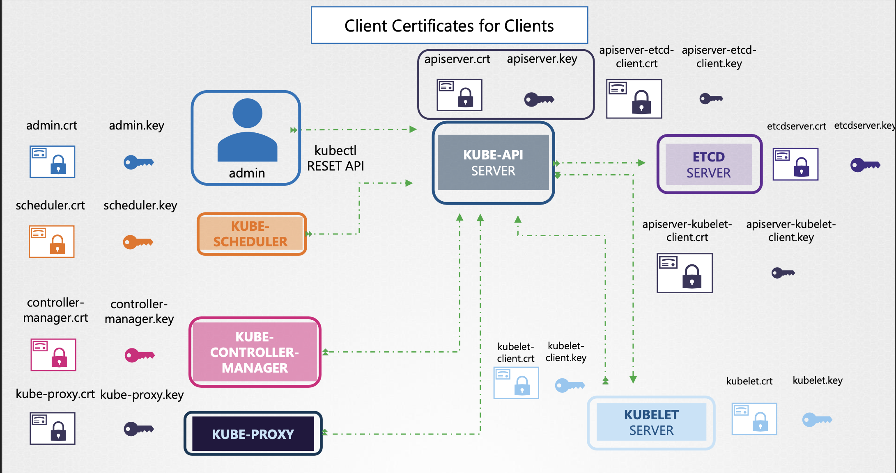

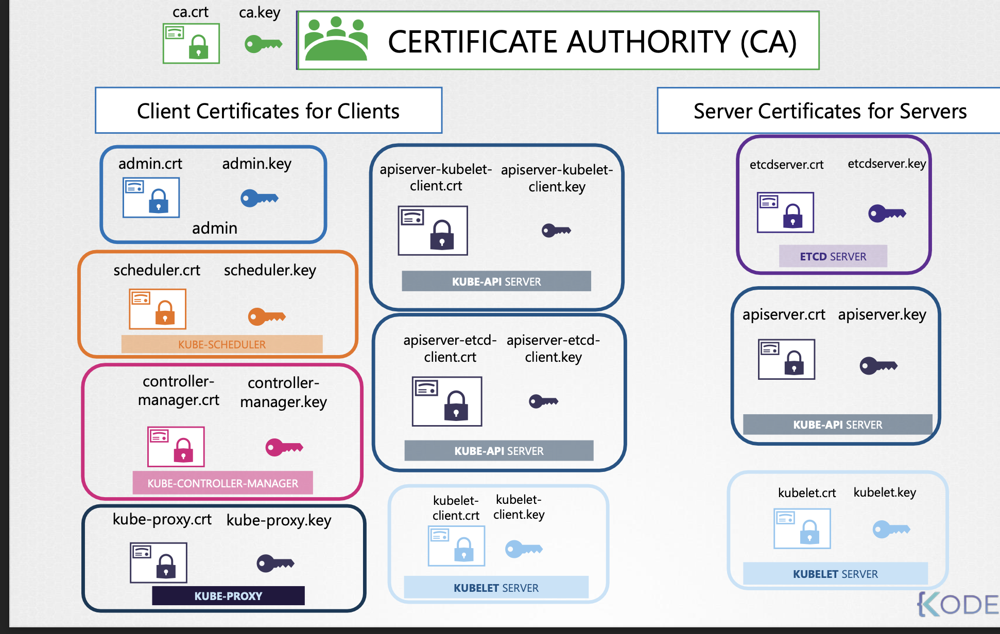

## [Generating Certificates](https://kubernetes.io/docs/tasks/administer-cluster/certificates/)

To generate a cert for an admin user:
1. `openssl genrsa -out admin.key 2048`

Below we mention the group in our CSR:
2. `openssl req -new -key admin.key -subj "/CN=kube-admin/O=system:masters" -out admin.csr`
We can follow the same process for other users, inlduiong services, but the must be prefixed with `SYSTEM:`

 
We can use the certificates in `kube-config.yaml` for authentication as well.

All services and users need a copy of the Certificate Authority's pub key and root certificate.

For kubelet, need a pair on each server running kubelet. Each kublet named after their node hostname.

## Viewing Certificates

In a cluster configured with `kubeadm` , All certs except kubelet certs appear to live in `/etc/kubernetes/pki/` .

Kubelet certs live in `/var/lib/kubelet/`

Information can be viewed with `openssl x509 -in /etc/kubernetes/pki/apiserver.crt -text- noout`

More on cert management [here](https://kubernetes.io/docs/tasks/administer-cluster/kubeadm/kubeadm-certs/).

## Certificates API

This can be used to:
1. Create CertificateSigningRequest Object
2. Review Requests
3. Approve Requests
4. Share Certs to Users

Typical flow:

* User creates key with their name on it: `openssl genrsa -out jane.key 2048`
* User creates a request (CSR): `openssl req -new -key jane.key -subj "/CN=jane" -out jane.csr`
* Then creates a CSR Object using yaml like below or [something like this](https://kubernetes.io/docs/reference/access-authn-authz/certificate-signing-requests/#create-certificatesigningrequest):

```yaml
apiVerison: certificates.k8s.io/v1beta1
kind: CertificateSigningRequest
metadata:
  name: jane
spec:
  groups:
  - system:authenticated
  usages:
  - digital signature
  - key encipherment
  - server auth
  request: # this is where the b64 encoded CSR goes
    someb64encodedstring=
```

Useful command for outputting b64 correctly: `cat csr_file | base64 -w0`

* Once the object is created, admin can run `kubectl get csr` to get csrs and then `kubectl certificate approve jane` to approve the csr

Allcertificate operations are carried about by the Controller Manager

## [Kubeconfig](https://kubernetes.io/docs/concepts/configuration/organize-cluster-access-kubeconfig/#file-references)

Located at `$HOME/.kube/config` .

Can use different contexts, which use the existing credentials to determine what user you are going to use with what cluster. See [configurating access to multiple clusters](https://kubernetes.io/docs/tasks/access-application-cluster/configure-access-multiple-clusters/).
