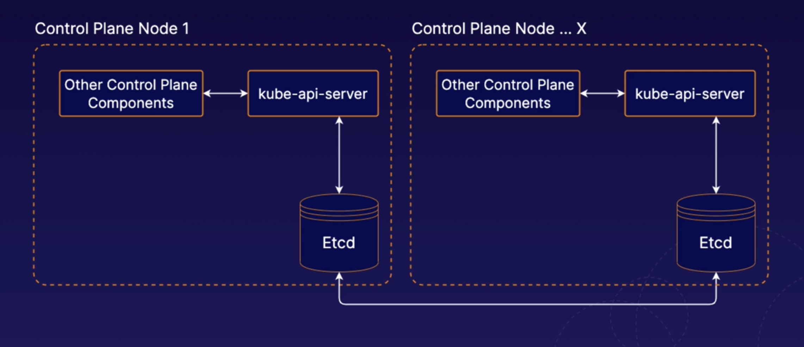

- [Big-Picture Overview](#big-picture-overview)
- [K8s Control Plane and Components](#k8s-control-plane-and-components)
  - [kube-api-server](#kube-api-server)
  - [etcd](#etcd)
  - [kube-scheduler](#kube-scheduler)
  - [kube-controller-manager](#kube-controller-manager)
  - [cloud-controller-manager](#cloud-controller-manager)
- [K8s Nodes](#k8s-nodes)
  - [kubelet](#kubelet)
  - [container runtime](#container-runtime)
  - [kube-proxy](#kube-proxy)
- [Building a K8s cluster](#building-a-k8s-cluster)
  - [kubeadm](#kubeadm)
- [Using Namespaces in K8s](#using-namespaces-in-k8s)
- [K8s Management](#k8s-management)
  - [Intro to K8s High-Availability (HA)](#intro-to-k8s-high-availability-ha)
  - [Intro K8s Management Tools](#intro-k8s-management-tools)
  - [Safely Draining a K8s Node](#safely-draining-a-k8s-node)
  - [Upgrading with `kubeadm`](#upgrading-with-kubeadm)
  - [Backup and restore etcd Cluster Data](#backup-and-restore-etcd-cluster-data)

# Big-Picture Overview

# K8s Control Plane and Components

The control plane is collection of multiple compnents resonsible for managing the cluster globally.

Individual control plane compnents can run on any machine in the cluster, but usually are run on dedicated *controller* machines.

## kube-api-server

Frontend; serves the K8s API which is the primary interface to the control plane and cluster itself.

You will usually interact with your cluster with this API.

## etcd

Backend data store for the kubernetes cluster/API. Provides high-availability storage for all data relating to the state of the cluster.

When performing operations against the API, data is being read from and written to etcd.

## kube-scheduler

Scheduling means selecting an available node in the cluster on which to run containers.

When using the API, for example, to run a pod or container, kube-scheduler is the component responsbile for assigning that container to a worker node.

## kube-controller-manager

Runs a collection of multiple controller utilities in a single process.

Manages utility processes related to automation within the cluster.

## cloud-controller-manager

Provides an interface between K8s and various cloud platforms. Only used when using cloud-based resources alongside K8s.

# K8s Nodes

Machines where containers are run in the cluster.

## kubelet

K8s agent that runs on each node. Communicates with the control plane. Basically manages containers on each node.

Handles process of reporting container status and other data about containers back to the control plane. Status of the node, various information about each container running on that node, etc.

## container runtime

Separate from K8s, not built in. Separate piece of software for actually running the containers.

K8s supports multiple container runtime implementations including Docker and containerd.

## kube-proxy

Network proxy, runs on each node and handles some tasks relating ot networking between containers and services in the cluster.

# Building a K8s cluster

## kubeadm

Tool that will simplify the process of setting up our kubernetes cluster.

[Building a Kubernetes Cluster](../assets/1623334133949-Building%20a%20Kubernetes%20Cluster.pdf)

# Using [Namespaces](https://kubernetes.io/docs/concepts/overview/working-with-objects/namespaces/) in K8s

Namespaces are essentially virtual clusters backed by the same physcial cluster. Kubernetes objects, such as pods and containers, live in namespaces. Namepsaces are a way to separate and organize objecs in your cluster.

In Kubernetes, namespace provides a mechanism for isolating groups of resources within a single cluster. Names of resources need to be unique within a namespace, but not across namespaces. Namespace-based scoping is applicable only for namespaced objects (e.g. Deployments, Services, etc) and not for cluster-wide objects (e.g. StorageClass, Nodes, PersistentVolumes, etc).

Kubernetes starts with four initial namespaces:

* `default` The default namespace for objects with no other namespace

* `kube-system` The namespace for objects created by the Kubernetes system

* `kube-public` This namespace is created automatically and is readable by all users (including those not authenticated). This namespace is mostly reserved for cluster usage, in case that some resources should be visible and readable publicly throughout the whole cluster. The public aspect of this namespace is only a convention, not a requirement.

* `kube-node-lease` This namespace holds Lease objects associated with each node. Node leases allow the kubelet to send heartbeats so that the control plane can detect node failure.

Useful for different apps in your cluster or for different teams in your cluster

List existing namespaces: `kubectl get namespaces`

All clusters have a default namespace. This is use when no other namespace is specified. *NOTE:* the default namespace is used when no other namespaces are specified. K8s is going to assume you want to use that default namespace.

Kubeadm clusters also have a namespace called `kube-system` , which contains system components, such as the components of the Kubernetes control plane itself.

When you're working with Kubernetes via kubectl, you may need to sometimes specify a namespace and you can do this with the
`--namespace` flag: `kubectl get pods --namepsace my-namespace`

Create a namespace: `kubectl create namespace my-namespace`

# K8s Management

## Intro to K8s High-Availability (HA)

K8s facilitates HA applications, but you can also design the cluster itself to be HA. Need *multiple control plane nodes* to do this.

When using multiple control planes for HA, you will likely need to communicate with the K8s API via a Load Balancer. This iobncludes clients such as kubelet instances running on worker nodes. 

### Stacked etcd

Runs on the same nodes as the rest of the control plane components. Design pattern used by clusters that are setup by `kubeadm` .

Each individual control plane nodes would have it's own etcd instance.

### External etcd

Etcd lives on completely different servers than where we are running our normal K8s control plane components. 

You can have any numver of K8s control plane instances and any number of etcd nodes. 

## Intro K8s Management [Tools](https://kubernetes.io/docs/reference/tools/)

There is a variety of management tools available for K8s. These tools interface with K8s to provide additional functionality. When using K8s, it is a good idea to be aware of some of these tools.

### `kubectl`

The official command line interface for K8s. It is the main method of interacting with K8s in the CKA.

### `kubeadm`

Tool that allows you to quickly and easily create K8s clusters. Like setting up the control plane and worker nodes.

### minikube

Allows for easy setup of a cluster with a single machine. Supports multi-nodes on local device.

### [Helm](https://medium.com/prodopsio/a-6-minute-introduction-to-helm-ab5949bf425)

Provides templating and package management system for K8s objects/ You can use it to manage your own templates (known as charts). You can also download and use shared templates. 

### Kompose

Helps you translate Docker compase files into K8s objects.

### Kustomize

A config mananagement tool for managing K8s object configs. 

## Safely Draining a K8s Node

### What is draining?

When performing maintenance, you may sometimes need to remove a K8s node from service.

To do this, you can drain the node. Containers running on the node will be gracefully terminated (and potentially rescheduled to another node)

Diagram of drain process:

### How to drain

To drain a node, use the `kubectl drain` command, e.g. `kubectl drain <node name> --ignore-daemonsets`

When draining a node, you may need to ignore [DaemonSets](https://kubernetes.io/docs/concepts/workloads/controllers/daemonset/) (like the command above). DaemonSets are pods that are tied to each node. If you have any DaemonSet pods running on the node, you will likely need to use the `--ignore-daemonsets` flag.

## Upgrading with `kubeadm`

## Backup and restore etcd Cluster Data
