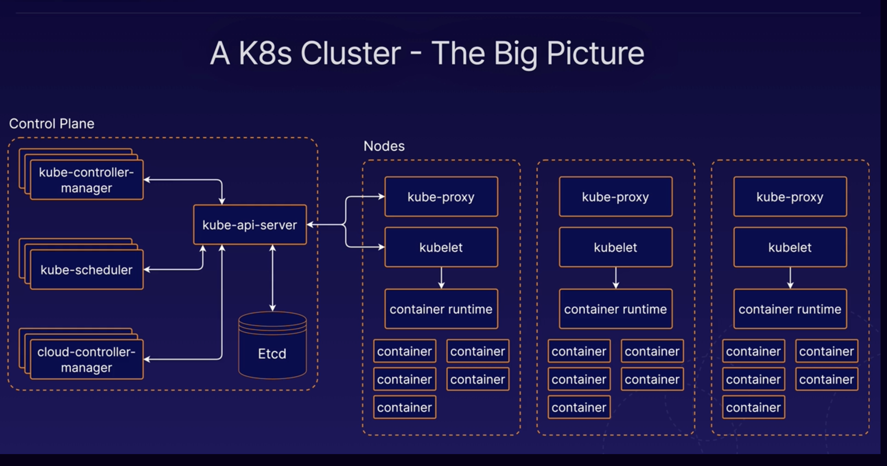

# Big-Picture Overview

# K8s Control Plane and Components

The control plane is collection of multiple compnents resonsible for managing the cluster globally.

Individual control plane compnents can run on any machine in the cluster, but usually are run on dedicated *controller* machines.

## kube-api-server

Frontend; serves the K8s API which is the primary interface to the control plane and cluster itself.

You will usually interact with your cluster with this API.

## etcd

Backend data store for the kubernetes cluster/API. Provides high-availability storage for all data relating to the state of the cluster.

When performing operations against the API, data is being read from and written to etcd.

## kube-scheduler

Scheduling means selecting an available node in the cluster on which to run containers.

When using the API, for example, to run a pod or container, kube-scheduler is the component responsbile for assigning that container to a worker node.

## kube-controller-manager

Runs a collection of multiple controller utilities in a single process.

Manages utility processes related to automation within the cluster.

## cloud-controller-manager

Provides an interface between K8s and various cloud platforms. Only used when using cloud-based resources alongside K8s.

# K8s Nodes

Machines where containers are run in the cluster.

## kubelet

K8s agent that runs on each node. Communicates with the control plane.

Handles process of reporting container status and other data about containers back to the control plane. Status of the node, various information about each container running on that node, etc.

## container runtime

Separate from K8s, not built in. Separate piece of software for actually running the containers.

K8s supports multiple container runtime implementations including Docker and containerd.

## kube-proxy

Network proxy, runs on each node and handles some tasks relating ot networking between containers and services in the cluster.

# Building a K8s cluster

## kubeadm

Tool that will simplify the process of setting up our kubernetes cluster.

[Building a Kubernetes Cluster](../assets/1623334133949-Building%20a%20Kubernetes%20Cluster.pdf)

