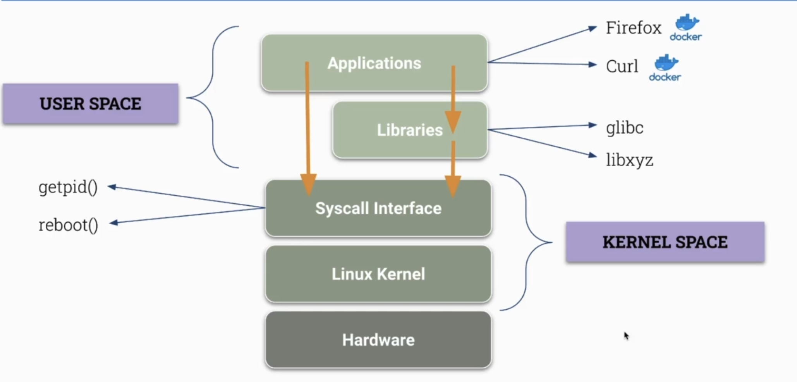
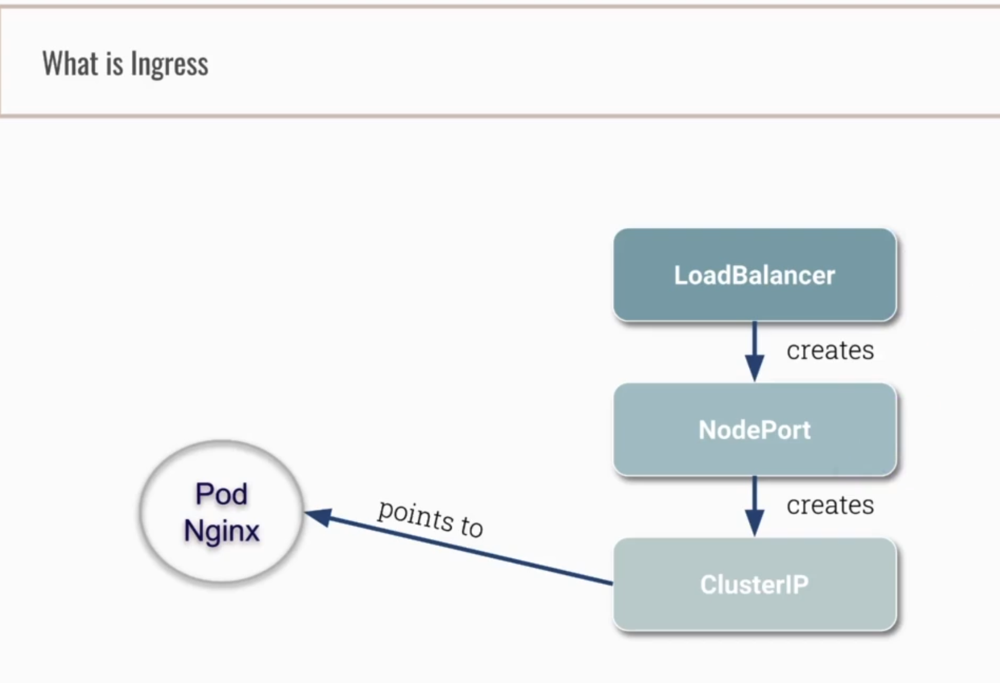
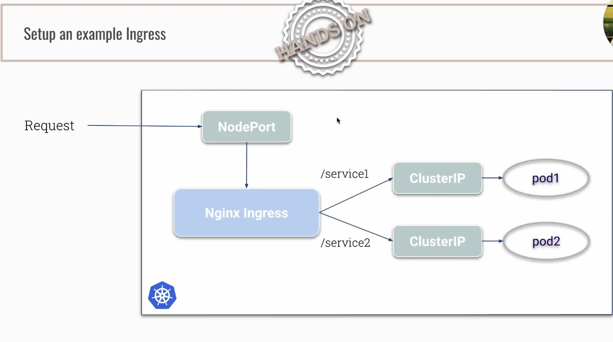
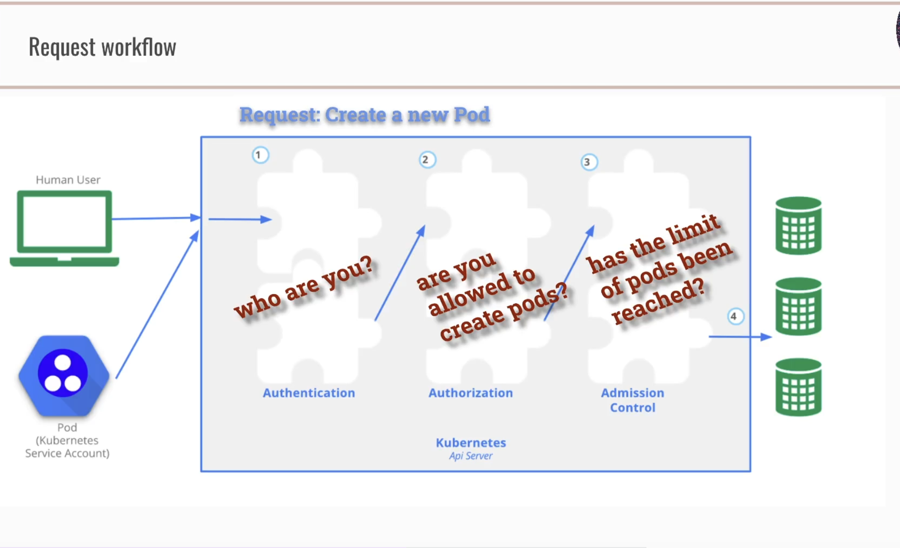
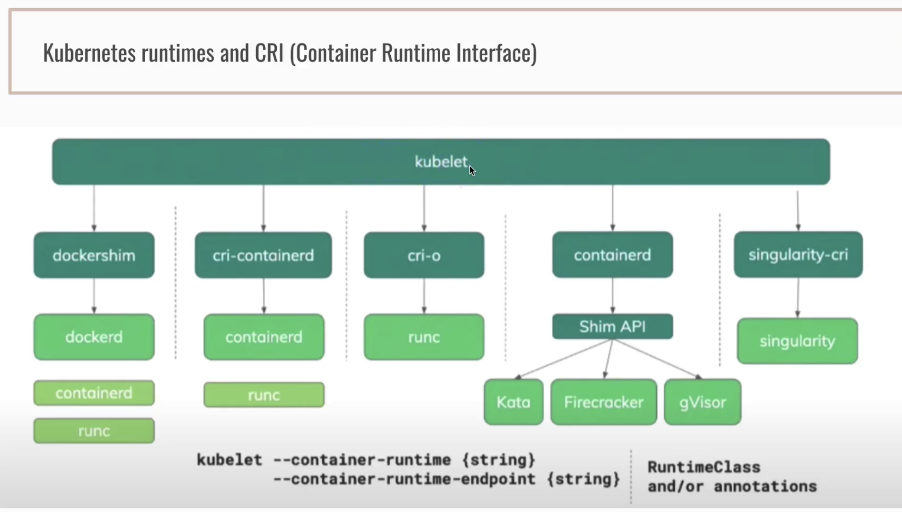
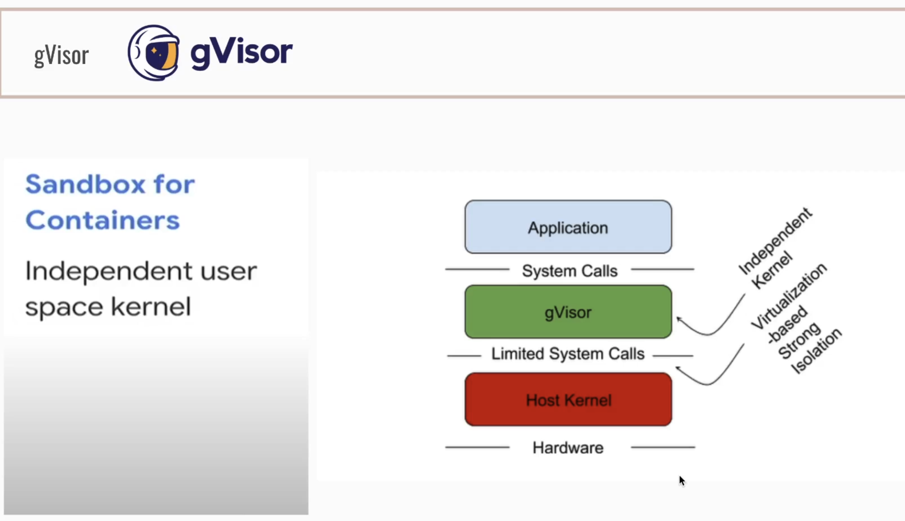

CKS Notes
- [Best Practice](#best-practice)
  - [Security principles](#security-principles)
  - [K8s security categories](#k8s-security-categories)
  - [K8s security best practices](#k8s-security-best-practices)
- [K8s Secure Architecture](#k8s-secure-architecture)
  - [Architecture](#architecture)
  - [Components](#components)
  - [Secure Component Communication](#secure-component-communication)
- [Containers under the hood](#containers-under-the-hood)
  - [Container](#container)
  - [Kernel vs User Space](#kernel-vs-user-space)
  - [Linux Kernel isolation](#linux-kernel-isolation)
  - [Container tools intro](#container-tools-intro)
- [Network Policies](#network-policies)
- [Secure Ingress (Basically just TLS setup)](#secure-ingress-basically-just-tls-setup)
  - [Recap](#recap)
  - [Example ingress](#example-ingress)
  - [TLS and ingress full setup](#tls-and-ingress-full-setup)
- [Node Metadata Protection](#node-metadata-protection)
  - [Cloud Platform Node Metadata](#cloud-platform-node-metadata)
- [CIS Benchmarks](#cis-benchmarks)
  - [What are CIS benchmarks?](#what-are-cis-benchmarks)
- [Cluster hardening - RBAC](#cluster-hardening---rbac)
  - [Accounts](#accounts)
  - [Users and Certs - Leak + Invalidation](#users-and-certs---leak--invalidation)
  - [How to create a cert+key and authenitcate as user "jane" (demo)](#how-to-create-a-certkey-and-authenitcate-as-user-jane-demo)
- [Cluster Hardening - Excercise caution in using ServiceAccounts](#cluster-hardening---excercise-caution-in-using-serviceaccounts)
  - [Custom service account for pod](#custom-service-account-for-pod)
  - [Disable ServiceAccount mounting](#disable-serviceaccount-mounting)
  - [Limit ServiceAccounts using RBAC](#limit-serviceaccounts-using-rbac)
- [Cluster Hardening - Restrict API Access](#cluster-hardening---restrict-api-access)
  - [Anonymous Access](#anonymous-access)
  - [Insecure Access](#insecure-access)
  - [Manual API Request](#manual-api-request)
  - [External APIserver Access](#external-apiserver-access)
  - [NodeRestriction and AdmissionController](#noderestriction-and-admissioncontroller)
- [Microservice Vulns - Manage K8s Secrets](#microservice-vulns---manage-k8s-secrets)
- [ETCD Encryption](#etcd-encryption)
- [Microservice Vulns - Cntainer Runtime Sandboxes](#microservice-vulns---cntainer-runtime-sandboxes)
  - [Sandbox](#sandbox)
  - [OCI - Open Container Initiative](#oci---open-container-initiative)
  - [katacontainers](#katacontainers)
  - [gVisor](#gvisor)
  - [Runtime class](#runtime-class)
- [Security Contexts](#security-contexts)
  - [Force containers to run as non-root](#force-containers-to-run-as-non-root)
  - [Privileged Containers](#privileged-containers)
  - [PrivilegeEscalation](#privilegeescalation)
  - [Pod Security Policies](#pod-security-policies)
- [mTLS (Mutual TLS)](#mtls-mutual-tls)
  - [mTLS pod to pod communication](#mtls-pod-to-pod-communication)
  - [Service Meshes](#service-meshes)

## Best Practice

### Security principles

* Defense in Depth
* Least Priv
* Limiting the attack surface
  + Removing unecessary applications
  + Firewall rules
  + etc.
  
Redunancy is good... in security

### K8s security categories

#### Host OS security

 * K8s nodes should only do K8s
 * Reduce attack surface

   * Remove unecessary apps
   * keep up to date

 * Runtime Security tools
 * Find and ID malicious processes
 * Restrict IAM/SSH access

#### K8s cluster security

 * K8s components are up to date

   * Apiserver
   * Kubelet
   * ETCD

 * Restrict External access to above
 * Use authentication -> authorization
 * AdmissionControllers

   * NodeRestrictions
   * Custom policies (OPA - Open Policy Agent)

 * Enable audit logging
 * Security benchmarking

#### Application security

* Use secrets/ no hardcoded credentials
* RBAC
* Container sandboxing
* Contianer hardening
  + Attack surface
  + Run as use
  + readonly filesystem
* Vuln scanning
* [mTLS/ServiceMesh](https://techgenix.com/mtls-service-mesh/)

Usually, K8s cluster security and Hos OS security are done in managed providers (GKE, EKS, etc.)

### K8s security best practices

[Talk by Ian Lewis, Google](https://www.youtube.com/watch?v=wqsUfvRyYpw)

## K8s Secure Architecture

### Architecture

See [CKA notes](https://github.com/whompus/notes/blob/master/K8s/cka.md) for general arch. 

### Components

[More on K8s components here](https://kubernetes.io/docs/concepts/overview/components/)

### Secure Component Communication

All You Need to Know About Certificates in Kubernetes
https://www.youtube.com/watch?v=gXz4cq3PKdg

Kubernetes Components
https://kubernetes.io/docs/concepts/overview/components

PKI certificates and requirements
https://kubernetes.io/docs/setup/best-practices/certificates

## Containers under the hood

### Container

* Collection of one or multiple applications
* Includes dependencies
* Jsut a process which runs on the Linux Kernel (but which cannot see everything)

### Kernel vs User Space



Syscall Interface can be seen as an API of sorts. Sits on top on Linux Kernel. System calls, like the ones shown, will be provided to libraries like the ones shown or applications. Bridges the cap to the Linux Kernel. 

### Linux Kernel isolation

Container isolation:

[Namespaces](https://www.nginx.com/blog/what-are-namespaces-cgroups-how-do-they-work/#What-Are-Namespaces) are for isolation, like PIDs, Mounts, Network (adapters, firewall, etc.), and Users. Don't use the host-root user (0) inside a container. Restrict what processes can see like:
* Other processes
* Users
* Filesystem

[cgroups](https://www.nginx.com/blog/what-are-namespaces-cgroups-how-do-they-work/#What-Are-cgroups) restrict the resource usage of processes like RAM, Disk and CPU.

### Container tools intro

* Docker - container runtime + tool for managing containers and images
* Containerd - container runtime
* critctl - CLI for CRI-compatible container runtimes
* [podman](https://podman.io/getting-started/) - tool for managing containers and images

## Network Policies

Default deny all to all pods:

```yaml
apiVersion: networking.k8s.io/v1
kind: NetworkPolicy
metadata:
  name: default-deny
  namespace: default
spec:
  podSelector: {} #this means ALL pods
  policyTypes:
    - Ingress
    - Egress
```

[More info here.](https://kubernetes.io/docs/concepts/services-networking/network-policies/)

Allow frontend pods to talk to backend:

## Secure Ingress (Basically just TLS setup)

### Recap



### Example ingress



### TLS and ingress full setup

https://github.com/killer-sh/cks-course-environment/tree/master/course-content/cluster-setup/secure-ingress

## Node Metadata Protection

[EKS security best practices here.](https://aws.github.io/aws-eks-best-practices/security/docs/)

### Cloud Platform Node Metadata

* Metadata service API by default reachable from VMs
* Can contain cloud credentials for VMs/Nodes
* Can contain provisioning data like kubelet creds
  
Limit permissions for instance credentials
* Ensure the cloud-instance-account has only the necessary perms
* Each cloud provider has a set of recommendations to follow
* Not in the hands of kubernetes

Restrict access using NetworkPolicies
 * Only allow certain pods to access metadata service, and deny others
 * Example on [github](https://github.com/killer-sh/cks-course-environment/tree/master/course-content/cluster-setup/protect-node-metadata).

You can play around with NetworkPolicies [here](https://editor.cilium.io/).

## CIS Benchmarks

Use CIS benchmarks to review secruity configuration.

### What are CIS benchmarks?

Center for Internet Security, provides best practices for the secure configuration of a target system.

Covers more than 14 technology groups.

[Download here](https://www.cisecurity.org/benchmark/kubernetes).

## Cluster hardening - [RBAC](https://kubernetes.io/docs/reference/access-authn-authz/rbac/)

[Good practices](https://kubernetes.io/docs/concepts/security/rbac-good-practices/).

Always test your RBAC rules!

### Accounts

Service Accounts - there is a ServiceAccount resource managed by the K8s API

Normal user - There is no K8s resource , it is assumed that a cluster-independent service manages normal users
* A user us someone with a cert and key
* If we have a client cert, it has to be signed by the K8s CA, and then the user has to be specified in the common name. 

[More on Authorization here](https://github.com/whompus/notes/blob/master/K8s/cka.md#authentication).

openssl create key -> create CSR ->send to API (use CertificateSigningRequest resource) -> CA signs cert via API -> user gets back a crt they can download to auth.

### Users and Certs - Leak + Invalidation

* No way to invalidate a cert.
* If a cert has been leaked:
  + Remove all access via RBAC
  + Usernae cannot be used until cert expired.
  + Create new CA and re-issue all certs

### How to create a cert+key and authenitcate as user "jane" (demo)

```bash
# on local machine
openssl genrsa -out jane.key 2048 # create key
openssl req -new -key jane.key -out jane.csr # create CSR, only set Common Name = jane

# create CertificateSigningRequest with base64 jane.csr
https://kubernetes.io/docs/reference/access-authn-authz/certificate-signing-requests
cat jane.csr | base64 -w 0 # paste value into "request" field in yaml

# add new KUBECONFIG
k config set-credentials jane --client-key=jane.key --client-certificate=jane.crt
k config set-context jane --cluster=kubernetes --user=jane
k config view
k config get-contexts
k config use-context jane
```

```bash
cat <<EOF | kubectl apply -f -
apiVersion: certificates.k8s.io/v1
kind: CertificateSigningRequest
metadata:
  name: # username
spec:
  request: # b64 enoded cert contents here
  signerName: kubernetes.io/kube-apiserver-client
  expirationSeconds: 86400  # one day
  usages:
  - client auth
EOF
```

## Cluster Hardening - Excercise caution in using ServiceAccounts

### Custom service account for pod

When creating a service account, make sure perms aren't too broad. 

If we create an account called "accessor" in the default ns, that token is visible and we can use that token to auth against the k8s api and do whatever we want.

By default, when we attach a SA to a pod, that pod will be able to communicate with the K8s api:

From inside a Pod we can do:

```bash
cat /run/secrets/kubernetes.io/serviceaccount/token

curl https://kubernetes.default -k -H "Authorization: Bearer SA_TOKEN"

# https://kubernetes.io/docs/tasks/run-application/access-api-from-pod

# Bound Service Account Tokens
https://github.com/kubernetes/enhancements/blob/master/keps/sig-auth/1205-bound-service-account-tokens/README.md
```

### Disable ServiceAccount mounting

Disabling the mount of the ServiceAccount token in a Pod; **does my pod need to talk to the K8s API?**

Answer to the above: most often not.

More often thannot use the `automountServiceAccountToken: false` attribute in ServiceAccount definition file. 

More info [here](https://kubernetes.io/docs/tasks/configure-pod-container/configure-service-account).

When setting that attribute, **every pods that uses this service account will not mount the token**.

Also can do it on a pod-by-pod basis by setting the same attribute in the pod definition file.

can check by creating the pod and moutnin the service account, then exec into the pod and running `mount | grep serv` .

If you also do a `k edit podname` , you can scroll down to the volumes section and view that there is no volume specified for the service account.

### Limit ServiceAccounts using RBAC

Make service accounts per application instead of using default service account.

If you mount service accounts to pods, restrict access using RBAC. 

https://kubernetes.io/docs/reference/access-authn-authz/service-accounts-admin

https://kubernetes.io/docs/tasks/configure-pod-container/configure-service-account

Priciple of least privilege.

## Cluster Hardening - Restrict API Access

In this section:
* Authentication Authorization Admission
* Connect to the API in different ways
* Restrict access in various ways



API requests are always tied to:
* A normal user
* A service account
* Are treated as anonymous requests

Every request must authenticate.

Some restrictions to consider:
1. Don't allow anonymous access
2. Close insecure ports
3. Don't expose API Server to the outside
4. Restrict access from Nodes to API (NodeRestriction o nthe admission controller)
5. Prevent unauthorized access (RBAC)
6. Prevent pods from accessing API
7. ApiServer port behind firewall/allowed ip ranges (cloud provider)

### Anonymous Access

 `kube-apiserver --anonymous-auth=true|false`

In 1.6+ anon access is enabled by default
* If authorization mode other than AlwaysAllow
* But ABAC and RBAC require explicit authorization for anonymous; so not completely open and insecure 

How to test anon access:
* View api server config at `/etc/kubernetes/manifests/kube-apiserver.yaml`
* Check for `--anonymous-auth=true|false` under kubeapi server params
* `curl https://localhost:6443 -k` is also a test
* Add `--anonymous access-auth=true|false` in the api server manifest

### Insecure Access

Via insecure port. Allows basically bypassing everything to access the API. will bypass authentication and authorization modules.

If in `/etc/kubernetes/manifests/kube-apiserver.yaml` the insecure port flag is set to 0, it is disabled.

### Manual API Request

View kubeconfig certs and perform a manual API query.

1. Get cert authority data from kubeconfig and decode from b64 and output to a file
2. Same thing for client certificate data 
3. Same for client key data
4. Make note of the server address (it's a local IP)
5. Use ab ove info to make base request `curl https://<server_address> --cacert <cert_authority_file> --cert <client_cert_data> --key <client_key_data_file>`

### External APIserver Access

Basically make the `kubernetes` service a nodeport and access via the external IP and nodeport.

### NodeRestriction and AdmissionController

https://kubernetes.io/docs/reference/access-authn-authz/admission-controllers/#noderestriction

https://sysdig.com/blog/kubernetes-admission-controllers/

in kube apiserver config, pass flag `--enable-admission-plugins=NodeRestriction`

Limits what a kubelet can do:
* Limits the Node labels a kubelet can modify; can only modify labels on it's own node and not other nodes.
* Can only modify labels on pods running on itself or on the same node.
* Enable secre workload isolation via labels
  + No one can pretend to be a "secure" node and schedule secure pods

Kubelet kind transforms an instance into a worker node and can communicate with the kubernetes API. 

https://kubernetes.io/docs/concepts/security/controlling-access

## Microservice Vulns - Manage K8s Secrets

Basically dont store secrets in git. They should be decoupled from the depoyment workflow of applications.

## ETCD Encryption

Always [encrypt ETCD](https://kubernetes.io/docs/tasks/administer-cluster/encrypt-data/) at rest. So that TA cannot read plaintext ETCD.

API Server should be the one responsible for encyrpting and decrypting content.

I nthe above link, the provider sections **works in order**.

First is used for encryption on save (on saving your resources).

If you leave `identity: {}` as the first entry, secrets will not be encrypted.

And example of ecrypting all secrets in ETCD:

```yaml
apiVersion: apiserver.config.k8s.io/v1
kind: EncryptionConfiguration
resources:
  - resources:
      - secrets
    providers:
      - aesgcm:
          keys:
            - name: key1
              secret: c2VjcmV0IGlzIHNlY3VyZQ==
            - name: key2
              secret: dGhpcyBpcyBwYXNzd29yZA==
      - identity: {}
```

Decrypt all secrets in ETCD:

```yaml
apiVersion: apiserver.config.k8s.io/v1
kind: EncryptionConfiguration
resources:
  - resources:
      - secrets
    providers:
      - identity: {}
      - aesgcm:
          keys:
            - name: key1
              secret: c2VjcmV0IGlzIHNlY3VyZQ==
            - name: key2
              secret: dGhpcyBpcyBwYXNzd29yZA==
```

[How to encrypt etcd data](https://kubernetes.io/docs/tasks/administer-cluster/encrypt-data/#encrypting-your-data).

Note: this does not encrypt existing secrets, only newly created. to recreate all secrets: `kubectl get secret -A -o yaml | kubectl replace -f -`

Another note: need to create volume mount and mount as hostpath.

Read secrets from etcd:

```bash
# read secret from etcd
ETCDCTL_API=3 etcdctl --cert /etc/kubernetes/pki/apiserver-etcd-client.crt --key /etc/kubernetes/pki/apiserver-etcd-client.key --cacert /etc/kubernetes/pki/etcd/ca.crt get /registry/secrets/default/very-secure
```

## Microservice Vulns - Cntainer Runtime Sandboxes

"Containers are not contained" - Just because it runs in a container doesn't mean it's more protected.

Kernel Group == cgroup

Virtual machines have stronger isolation level than containers. cgroups are able to talk to each other by default

### Sandbox

Common implementations for sandboxes:
* Playground when implementing API or similar
* Simulated testing environment
* Dev server

What we are focused on: **Security layer to reduce attack surface**

`strace` - shows what syscalls are made

### OCI - Open Container Initiative

[Linux Foundation project to design open standards for virtualizaion](https://opencontainers.org/)

* Specification:
  + runtime, image, distribution
* Runtime
  + runc (container runtime that implements their specification)

In the early times, docker was tightly coupled with kubernetes. OCI allows kubelet to interact with different runtimes like crio-c, cri-containerd, etc.



### katacontainers

[Documentation here.](https://katacontainers.io/)

### gVisor

User-space kernel for containers.

* Adds another layer of separation
* Not hypervisor/VM based
* Simulates kernel syscalls with limited finctionailty
* Runs in user-space spearated from linux kernel
* Runtime called runsc



### Runtime class

[K8s Docs](https://kubernetes.io/docs/concepts/containers/runtime-class/)

[Example of Pod+RuntimeClass](https://github.com/killer-sh/cks-course-environment/blob/master/course-content/microservice-vulnerabilities/container-runtimes/gvisor/example.yaml)

Intasllation of gvisor on worker node:

```bash
# IF THE INSTALL SCRIPT FAILS then you can try to change the URL= further down in the script from latest to a specific release

bash <(curl -s https://raw.githubusercontent.com/killer-sh/cks-course-environment/master/course-content/microservice-vulnerabilities/container-runtimes/gvisor/install_gvisor.sh)
```

Container Runtime Landscape
https://www.youtube.com/watch?v=RyXL1zOa8Bw

Gvisor
https://www.youtube.com/watch?v=kxUZ4lVFuVo

Kata Containers
https://www.youtube.com/watch?v=4gmLXyMeYWI

## Security Contexts

https://kubernetes.io/docs/reference/generated/kubernetes-api/v1.20/#podsecuritycontext-v1-core

Define privilege and access control for Pod/Container
* userID and groupID
* Run privileged or unprivileged
* Linux capabilities
* ..... and much more!

Can be pod level (all containers) or at Container level (pod-leveloverride)

### Force containers to run as non-root

https://kubernetes.io/docs/tasks/configure-pod-container/security-context/

basically should have:

```yaml
apiVersion: v1
kind: Pod
metadata:
...
spec:
...
  containers:
  - name: test-pod
    image: some-image-that-doesn't-require-root
    ...
    securityContext:
      runAsNonRoot: true
    ...
...
```

Note: the above only works with images that dont require root for processes. 

### Privileged Containers

By default, containers run as privileged. 

It's possible to run as privileged to access all devices and run docker daemon inside container. 

**Privileged means that container user 0 (root) is directly mapped to host user 0 (root)**

How to enable privileged:

```yaml
apiVersion: vl
kind: Pod
metadata:
  creationTimestamp: null
  labels:
    run: pod
  name: pod
spec:
  containers:
  - command:
    - sh
    - -C
    - sleep 1d
    image: busybox
    name: pod
    resources: (}
    securityContext:
      privileged: true
  dnsPolicy: ClusterFirst
  restartPolicy: Always
status: {}
```

### PrivilegeEscalation

** `AllowPrivilegeEscalation` controls whether a process can gain more privleges than its parent process.**

[Docs.](https://kubernetes.io/docs/concepts/security/pod-security-policy/#privilege-escalation)

Spec should look like this for disabled (for a deployment example):

```yaml
...
spec:
  replicas: 3
  selector:
    matchLabels:
      app: logger
  strategy: {}
  template:
    metadata:
      labels:
        app: logger
    spec:
      containers:
      - image: httpd:2.4.52-alpine
        name: httpd
        securityContext:
            allowPrivilegeEscalation: false
...
```

### Pod Security Policies

* Cluster level resource
* Controls under which security conditions a Pod has to run

[More info in the docs](https://kubernetes.io/docs/concepts/security/pod-security-policy/).

Apparently deprecated in 1.25. 

How to create a PodSecurityPolicy using the PodSecurityAdmisssionController to always enforce no allowPrivelegeEscalation:
1. Edit `/etc/kubernetes/manifests/kube-apiserver.yaml`
2. Find the `--enable-admission-plugins=` flag
3. Add `PodSecurityPolicy`, it may look like this after: `--enable-admission-plugins=NodeRestriction,PodSecurityPolicy`
   1. This will enable the admission plugin
4. [Example of pod with security policy](https://kubernetes.io/docs/concepts/security/pod-security-policy/#create-a-policy-and-a-pod)

Some important notes:

Once you enable the pod security policy admission controller, no pod will be able to be created. 
Every pod creation will be denied in the whole cluster. the only pods that will be able to be created 
which can use the pod security policy. And then if that pod security policy allows the pod specification.

An example is with a deployment that contains a service account that cannot see or use that pod security policy. The pods will not start.
Even if we as admins create the deployment, the deployment itself does not run with admin rights.

If we, as admins, create a pod by itself, we have access to that pod security policy, so the pods will start.

A Solution to this is give the default service account authorization to see the pod security policy via a role:

 `k create role psp-access --verb=use --resource=podsecuritypolicies`

and a rolebinding:

 `k create rolebinding psp-access --role=psp-access --serviceaccount=default:default`

## mTLS (Mutual TLS)

[Good detailed guide here](https://buoyant.io/mtls-guide).

* Mutual authentication
* Two-way (bilateral authentication)
* Two parties authenticating each other at the same time

### mTLS pod to pod communication

By default, unencrypted pop to pod communication between pods in a cluster.

Common to perform TLS termination on the ingress.

mTLS allows encrypted pop to pod communication.

### Service Meshes

Uses sidecar proxy containers. Uses iptables rules to route traffic via proxy. E.g. initContainer Needs NET_ADMIN capability.

Proxy contaienr could be managed externally.

[Good article here](https://istio.io/v1.10/blog/2019/data-plane-setup/).
