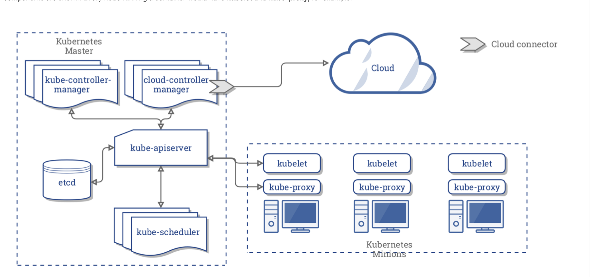

# Kubernetes notes

## Architecture

Useful links:

* https://kubernetes.io/docs/concepts/architecture/cloud-controller/

Courtesy of LinuxFoundation:

Kubernetes architecture consists of a central manager (aka **master** or **primary**) and some **worker** nodes.

* Master runs an APi server, scheduler, various controllers and a storage system to keep the state of the cluster, container settings, and network config
* K8s exposes an API via the API server
  * You can interact with the API using a local client called `kubectl`.
  * Alternatively, you can use `curl` commands (not ideal)
  * The **kube-scheduler** is forwarded the requests for running containers coming to the API and finds a sutiable node to run that container
* Each node in the cluster runs two processes: a kubelet and kube-proxy
  * kubelet recieved requests to run the containers, manages any necessary recourses and watches over them in the local node
  * kubelete interacts with container engine (docker by default)
  * kube-porxy creates and manges networking rules to expose the container on the network

Terminology:
* Pod
  * Consists of one or more contaienrs that share an IP, access to storage, and namespace
  * Typically, one container in a Pod runs an app, while other containers support the primary app
* Namespaces
  * Used for keeping objects distinct from each other for resource control and mutli-tenant considerations
  * Can scope objects to a namepsace or cluster-wide
* Operators or controllers
  * Also called watch-loops, orchestration is manged through a series of these
  * These interrogate the **kube-apiserver** for a particular object state, then modifying the object until the declared state matches the current state
  * Controllers arte compiled in the **kube-controller-manager**, but others can be added using custom resource definitions
* Deployments
  * Default and feature-filled operator for containers
  * Does not work directly with pods, but instead manages **ReplicaSets**
* 