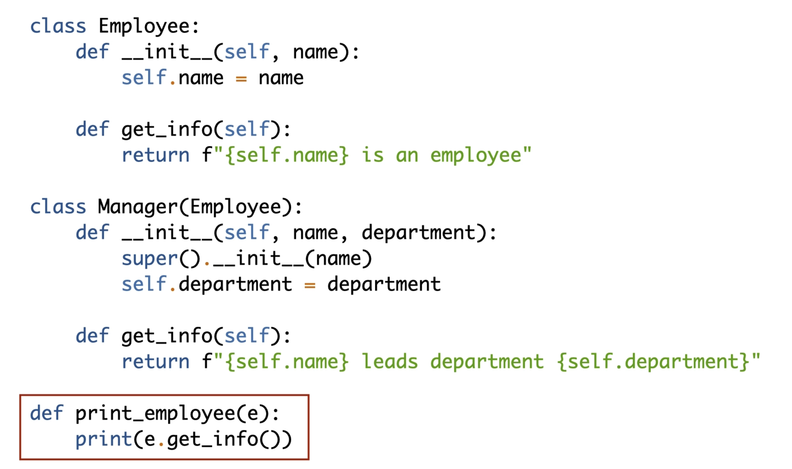
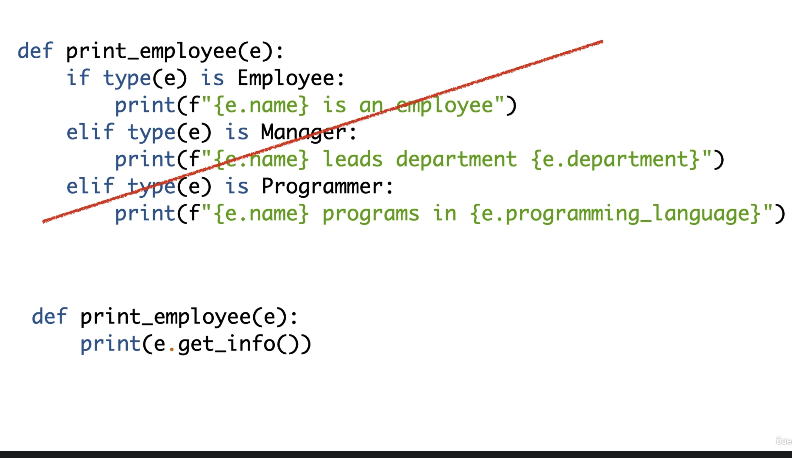

# SOLID Design Principles in Python

## Single Responsibility Principle

Things like classes and modules should have only a single reason to change.

If you have a class with functionality A and B inside, you might break B by changing A just from the fact taht they share the same class.

#### TooManyThingsNameProblem:

* Classes get big when they have many resposibilities
* Naming classes is hard and finding  is hard

Basically having a class that does too many things. 

Class name should tell us what it's responsbile for. If you see big class names, it could be a clue that the class is doing too many different things.

#### Mixing Responsibilities

* Dangerous to change code around other unrelated code

Hard to add or delete code without worrying that you'll break something. Break classes or objects up logically. Can pass information between those objects to avoid dependency issues.

#### Dependencies on Libraries

* Harmless dependency in one class starts to invade another unrelated class.

Say you need a json serializer in one class, but it requires attributes in another class to be serializable. so you decorate the attributes in the other object, but then have an unrelated dependency in that object. That object doesn't need to be aware of anything related to json.

## Open-Closed Principle

Open for extension but closed for modification.

As an example: don't get too reliant on switches (if/elif) on object types. Like if we are trying to run code based on if an employee is a manager or employee. Because you'll have ot add those switches to many places in your code. 

```python
def print_employee(e):
    if type(e) is Employee:
        # do something
    elif type(e) is Manager:
        # do other things
```

One technique to solve the probelm is polymorphism.

Employee class will get a `get_info()` method and the Manager class will override that method with it's own `get_info()`



Example of what not to do: 


## Liskov Substitution Principle

Subclasses should not change the behavior of superclasses in unexpected ways. 

Closely related to the open-closed principle.

More info [here](https://stackoverflow.com/questions/56860/what-is-an-example-of-the-liskov-substitution-principle).

How to violate this principle:
- Selecting on types
- Break the is-a relationship
- Raise error in overriden method
- Break contraints

## Interface Segregation Principle

No client should be forced to depend on methods it does not use. 

Examples [here](https://www.pythontutorial.net/python-oop/python-interface-segregation-principle/).

## Dependency Inversion Principle

High level modules should not depend on low level modules. Instead, they should depend on abstractions. 

Concrete classes are volatile.

Depending on concrete classes breaks the Open-closed principle. 

More [here](https://www.pythontutorial.net/python-oop/python-dependency-inversion-principle/).
