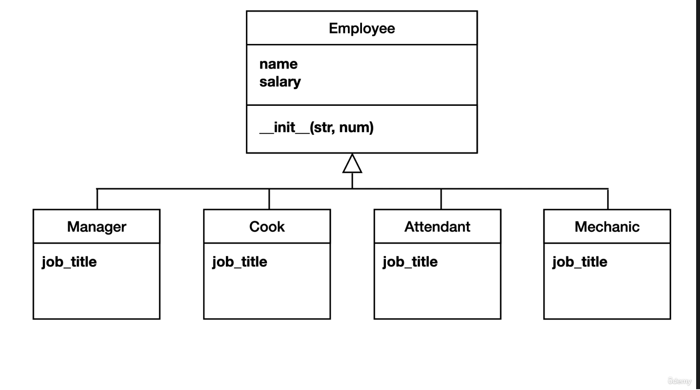

# Object Oriented Programming

What we will have in our toolbox by the end of this course:

- Objects and Classes
- Inheritance
- Encapsulation
- Polymorphism
- Composition

## OOP and OO

OO = Object Orientation

OOP = Object oriented Programming

## What problems does OO solve?

**Code always grows and code always changes.** As your script grows, you'd ideally break it out into modules. As modules
start to grow, they can be split into smaller modules. The goal at this point is to improve readability. OO is about
structuring modules to prevent rigid and fragile code.

## Managing dependencies

Change is dangerous, if you combine things that do not really belong together, the risk of breaking stuff when you need
to change something increases. Best practice is to create small modules that have a _**single**_ responsibility.

### Rigid vs. Fragile code

Rigidity is code that is so tightly coupled that a small change in one part of the system forces you to make massive
changes in other parts of the system.

Fragility is where a small change in one part of the system breaks other parts, even if the parts seem to be unrelated.

### Problem indicators

- Duplicate code: code that appears in more than one place
- Coupling: code is so tightly coupled to other parts of the code that it makes it incredibly hard to change code
  without
  causing major changes in the system
- No Single Responsibility: says that a module should one have one reason to change. If you have to constantly update a
  module, that module is probably doing too many things and violating the single responsibility principle.
- if/else blocks: when they perform different actions based on different object types (example to come later)

### Dependency trees

One concept to wrangle spaghetti code (or prevent it in the first place) is a dependency tree. It is easy to see how the
modules depend on each other. Organizing code is the art of finding the right tree structure.

## Defining a class and why it's useful

Take employees for example, instead of keeping track of lists of names and salaries, create an object.
With the employee class, we can create employee objects from that class. As many as you want. Classes can be thought of
as blueprints. Say, for a car. The blueprint is not the car itself, but if you can read the blueprint, you can make
cars from it.

### UML (Universal Modeling Language)

Has symbols to represent software. Diagram sample below. Any programmer should be able to take this diagram and
translate it to code.

| _Class Name_ <br/>Employee         |
|------------------------------------|
| _Attributes_<br/>name<br/>salary   |
| _Methods_<br/>`__init__(str, num)` |

## Inheritance

Take this class for example:
```python
class Employee:
    # the dunder init is the moment where you can inject information into the object. if a class needs data to work
    # with, the dunder init method is way to get the data in the object.
    # In this case, it expects a name a salary when it is instantiated.
    def __init__(self, name, salary, job_title):
        self.name = name
        self.salary = salary
        self.job_title = job_title


employees = [
    Employee("Vera", 2000, "Manager"),
    Employee("Chuck", 1800, "Station Attendant"),
    Employee("Samantha", 1800, "Station Attendant"),
    Employee("Roberto", 2100, "Cook"),
    Employee("Joe", 2000, "Mechanic"),
    Employee("Dave", 2200, "Mechanic"),
    Employee("Tina", 2300, "Mechanic")
]

for e in employees:
    print(f"{e.name}, ${e.salary}, {e.job_title}")
```

If we wanted to update `Station Attendant` or `Mechanic`, we would have to manually update several lines of code. It 
appears that we have duplicate code. With only needing to update 2 job titles, we had to update 5 lines of code. 

Wouldn't it be great if we could make employee types that know what their job title is? This is where we can use 
[Inheritance](https://www.programiz.com/python-programming/inheritance).

We can make types for Manager, Station Attendant, Cook, and Mechanic. Here's how the UML might look (One thing to note 
is that `job_title` should be underlined because it is a class variable, typo in the diagram):



Where Employee is a superclass, and the job title subclasses underneath. Each subclass inherits from the superclass.

If we wanted to add another attribute or method, we decide whether that will be in the superclass (like birthday), or
something like recipes, which would only be specific to the cook class. General = superclass, Specific = subclass. Below
is what that would look like in code.

```python
class Employee:
    # the dunder init is the moment where you can inject information into the object. if a class needs data to work
    # with, the dunder init method is way to get the data in the object.
    # In this case, it expects a name a salary when it is instantiated.
    def __init__(self, name, salary):
        self.name = name
        self.salary = salary


class Mechanic(Employee):  # this tells python that mechanic is inherited from employee
    job_title = "Mechanic"


class Manager(Employee):
    job_title = "Manager"


class Attendant(Employee):
    job_title = "Station Attendant"


class Cook(Employee):
    job_title = "Cook"


employees = [
    Manager("Vera", 2000),
    Attendant("Chuck", 1800),
    Attendant("Samantha", 1800),
    Cook("Roberto", 21),
    Mechanic("Joe", 2000),
    Mechanic("Dave", 2200),
    Mechanic("Tina", 2300)
]

for e in employees:
    print(f"{e.name}, ${e.salary}, {e.job_title}")
```

## Dependency Injection

DI is a technique for defining the dependencies among objects. Basically, prevents coupling. In a nutshell, what it 
means is that any given piece of code you write should be provided everything it needs to do its job, instead of creating 
things for itself.
[More here](https://www.reddit.com/r/explainlikeimfive/comments/1ezihq/eli5_dependency_injection_in_programming_why_use/).

## More on inheritance

Given the below code, we see the dunder init methods are duplicated. 

```python
class AccountingReport:
    def __init__(self, emp_list):
        self._emp_list = emp_list

    def print_accounting_report(self):
        print("Accounting")
        print("==========")
        for e in self._emp_list:
            print(f"{e.get_full_name()}, ${e.salary}")


class StaffingReport:
    def __init__(self, emp_list):
        self._emp_list = emp_list

    def print_staffing_report(self):
        print("Staffing")
        print("==========")
        for e in self._emp_list:
            print(f"{e.get_full_name()}, ${e.job_title}")
```

We are going to go from bottom up with inheritance to create a `Report` superclass:

```python
class Report:
    def __init__(self, emp_list):
        self._emp_list = emp_list


class AccountingReport(Report):
    def print_accounting_report(self):
        print("Accounting")
        print("==========")
        for e in self._emp_list:
            print(f"{e.get_full_name()}, ${e.salary}")


class StaffingReport(Report):
    def print_staffing_report(self):
        print("Staffing")
        print("==========")
        for e in self._emp_list:
            print(f"{e.get_full_name()}, ${e.job_title}")

```

