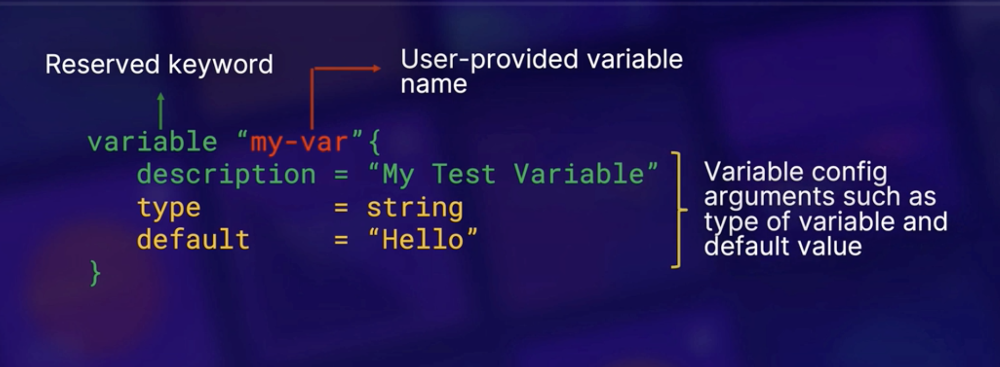
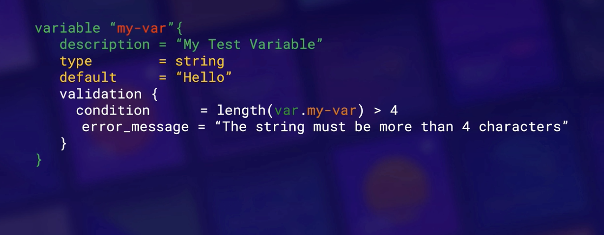
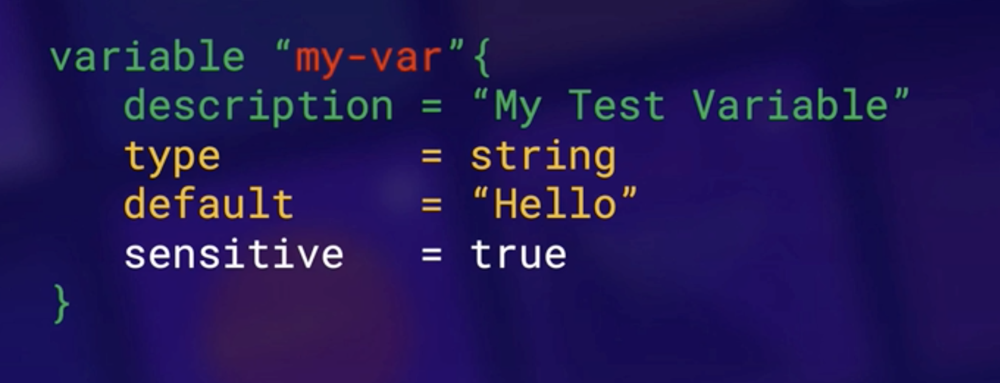
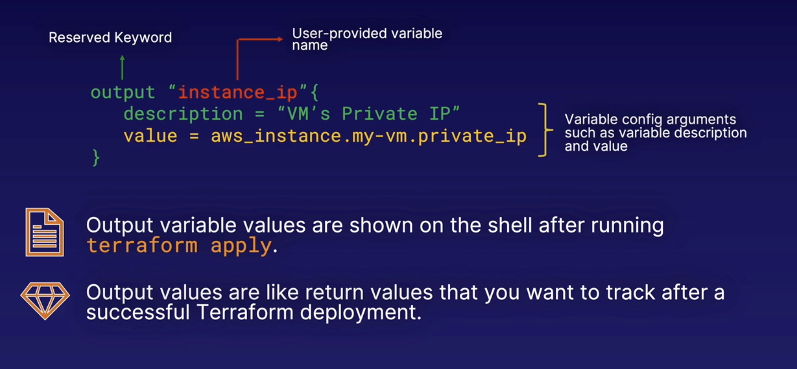

## Table of Contents
- [Basics of IaC and its benefits](#basics-of-iac-and-its-benefits)
- [Initializing your TF dir](#initializing-your-tf-dir)
- [Plan, Apply, Destroy](#plan-apply-destroy)
- [Understanding Terraform Code](#understanding-terraform-code)
- [Terraform State basics](#terraform-state-basics)
- [Terraform Variables and Outputs](#terraform-variables-and-outputs)

---

# Basics of IaC and its benefits

## What is IaC?

- For the most part, written declaratively via code, but can be procedural (imperative) as well. More on the differences between the two [here](https://stackoverflow.com/questions/1619834/what-is-the-difference-between-declarative-and-procedural-programming-paradigms#:~:text=Declarative%20programming%20is%20where%20you,steps%20to%20produce%20the%20result.)

  - Write exactly as you want, without having to worry about underlying functions or API calls that will need to be made to deply the infra
  - When someone reads it, they know exactly what is happening

- Tracked in version control; better visibility and collaboration between teams
- Speed, cost, reduced risk
- HCL - Hashicorp Configuration Language

## Sample HCL code

```hcl
#declare provider
provider "aws" {}

#Create VPC in us-east-1
resource "aws_vpc "vpc_master" {
    cidr_block           = "10.0.0.0/16"
    enable_dns_support   = true
    enable_dns_hostnames = true
    tags = {
        Name = "master=vpc-jenkins"
    }
}
```

# Initializing your TF dir
`terraform init` initializes the working directory that contians your TF code.

- Downloads acillary compnents like modules and plugins so you can talk to your cloud infra
- Sets up backend for stroing TF state file, and mechanism by where it tracks resources

# Plan, Apply, Destroy
General workflow: 


`terraform plan`

 - Reads code and shows a 'plan' of execution and deployment
 - Essentially a read-only command or dry-run command
 - Allows user to review the action plan before executing anything
 - Authentication creds are used to connect to your infra

`terraform apply`

- Actually deploys all the code into your cloud infra
- Updates state file or creates one
- Could potentially remove other resources not defined in TF code

`terraform destroy`

- Looks at state file, and destroys all resources created by your code

# Understanding Terraform Code

## Configuring the provider


## Resource block


- Creates **new resource**
- To access to the resource in your code, use the resource address, as outlined above
- Arguments will change based on which resource you are creating

## Data source block


- Fetches info on an **already-existing** resource in your environment
- To access to the resource in your code, use the resource address, as outlined above

<<<<<<< HEAD
# Terraform State basics

## What is "state?"
- A way for TF to keep tabs on what has been deployed
  - Helps TF calculate deployment deltas and create new deplyment plans
  - `terraform plan` calculates against the state file for changes
- Stored in flat files by default named "`terraform.tfstate`"
  - Can be stored locally or remotely (like an S3 bucket)
- Dump of metadata that keeps track of deployment and what has been deployed
  - On `terraform destroy`, terraform will look at the state file and determine which resources to destroy. Instead of making api calls to determine what is currently in your infra

NEVER LOSE YOUR STATE FILE OR MAKE IT PUBLIC

# Terraform Variables and Outputs
=======
## Variables and Outputs



- Default value in case the user doesn't provide one explicitly
- Configuration between curly braces are optional, could declare something like:

    ```
    variable "my-var" {}
    ```

    - In this case, you will need to pass the variable a value either through an OS environment variable or command line input

- To reference the variable, use:

    ```
    var.my-var
    ```
- Best practice to collect all variable in a file called `terraform.tfvars`

### Variable Validation (optional)



- Useful because you don't want to find out midway that the value passed was illegal and wait for everything to roll back.
  - Terrafrom will stop deployment if variable doesn't meet the condition

- Sensitive param allows you to hide sensitive variable values so it is not shown during execution:



### Variable Type Contraints

Basic Types:
 - string
 - number
 - bool

Complex Types:
 - list, set, map, object, tuple

Examples:

```
# String Type

variable "image_id" {
    type    = string
    default = "Hello"
}
```

```
# List Type

variable "availability_zone_names" {
    type    = list(string)
    default = ["us-west-1a]
}
```

```
# List of Objects

variable "docker_ports" {
    type = list(object({
        internal = number
        external = number
        protocol = string
    }))
    default = [
        {
            internal = 8300
            external = 8300
            protocol = "tcp"
        }
    ]
}
```

### Terraform Output - Output Values


>>>>>>> b7dd0020f7a4549e881a88eeea81f13bd718b863
