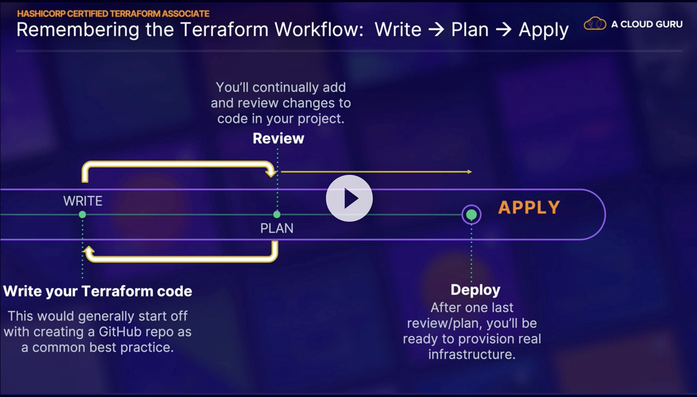
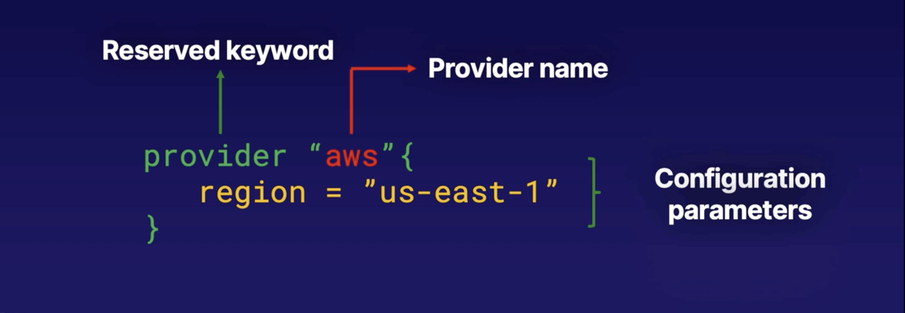
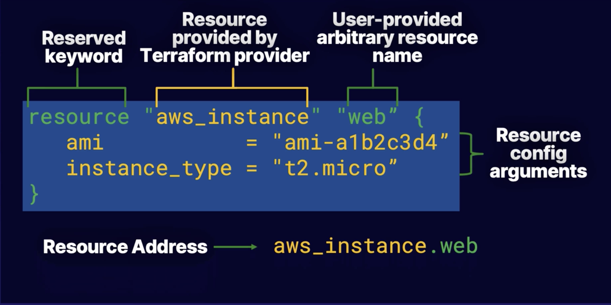
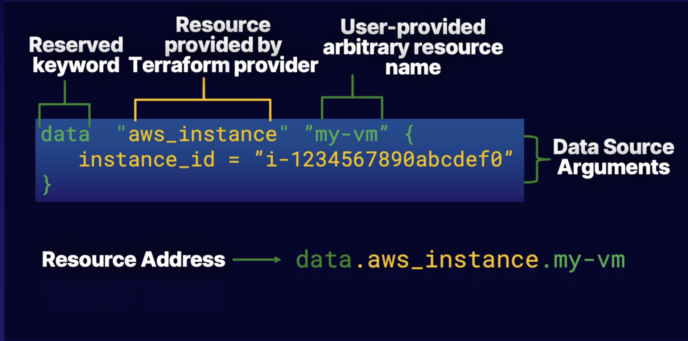

## Table of Contents
- [Basics of IaC and its benefits](#basics-of-iac-and-its-benefits)
- [Initializing your TF dir](#initializing-your-tf-dir)
- [Plan, Apply, Destroy](#plan-apply-destroy)
- [Understanding Terraform Code](#understanding-terraform-code)

---

# Basics of IaC and its benefits

## What is IaC?

- For the most part, written declaratively via code, but can be procedural (imperative) as well. More on the differences between the two [here](https://stackoverflow.com/questions/1619834/what-is-the-difference-between-declarative-and-procedural-programming-paradigms#:~:text=Declarative%20programming%20is%20where%20you,steps%20to%20produce%20the%20result.)

  - Write exactly as you want, without having to worry about underlying functions or API calls that will need to be made to deply the infra
  - When someone reads it, they know exactly what is happening

- Tracked in version control; better visibility and collaboration between teams
- Speed, cost, reduced risk
- HCL - Hashicorp Configuration Language

## Sample HCL code

```hcl
#declare provider
provider "aws" {}

#Create VPC in us-east-1
resource "aws_vpc "vpc_master" {
    cidr_block           = "10.0.0.0/16"
    enable_dns_support   = true
    enable_dns_hostnames = true
    tags = {
        Name = "master=vpc-jenkins"
    }
}
```

# Initializing your TF dir
`terraform init` initializes the working directory that contians your TF code.

- Downloads acillary compnents like modules and plugins so you can talk to your cloud infra
- Sets up backend for stroing TF state file, and mechanism by where it tracks resources

# Plan, Apply, Destroy
General workflow: 



`terraform plan`

 - Reads code and shows a 'plan' of execution and deployment
 - Essentially a read-only command or dry-run command
 - Allows user to review the action plan before executing anything
 - Authentication creds are used to connect to your infra

`terraform apply`

- Actually deploys all the code into your cloud infra
- Updates state file or creates one
- Could potentially remove other resources not defined in TF code

`terraform destroy`

- Looks at state file, and destroys all resources created by your code

# Understanding Terraform Code

## Configuring the provider



## Resource block



- Creates **new resource**
- To access to the resource in your code, use the resource address, as outlined above
- Arguments will change based on which resource you are creating

## Data source block



- Fetches info on an **already-existing** resource in your environment
- To access to the resource in your code, use the resource address, as outlined above
